# Spendifre — Functional Flows

Three views of the system: how **data** moves and where each control sits,
how **users** get work done per role, and how the **engineering** pieces
interact at build, test, run and deploy.

Source diagrams are in [`flows/`](./flows) as Mermaid `.mmd`; rendered SVGs
are in [`images/`](./images) and collected in
[`flows-gallery.html`](./flows-gallery.html).

| Group | Diagrams |
|---|---|
| System & data flows | 18 |
| User journeys | 4 |
| Software-development interaction | 6 |

---

# System & data flows

How Spendifre moves data and where each control sits in the path.

## Application map & navigation

<sub>`flows/00-app-sitemap.mmd`</sub>

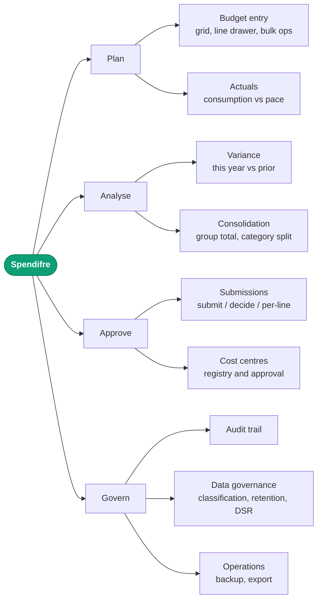

## Authentication — Entra ID, OIDC + PKCE

<sub>`flows/01-auth-rbac.mmd`</sub>

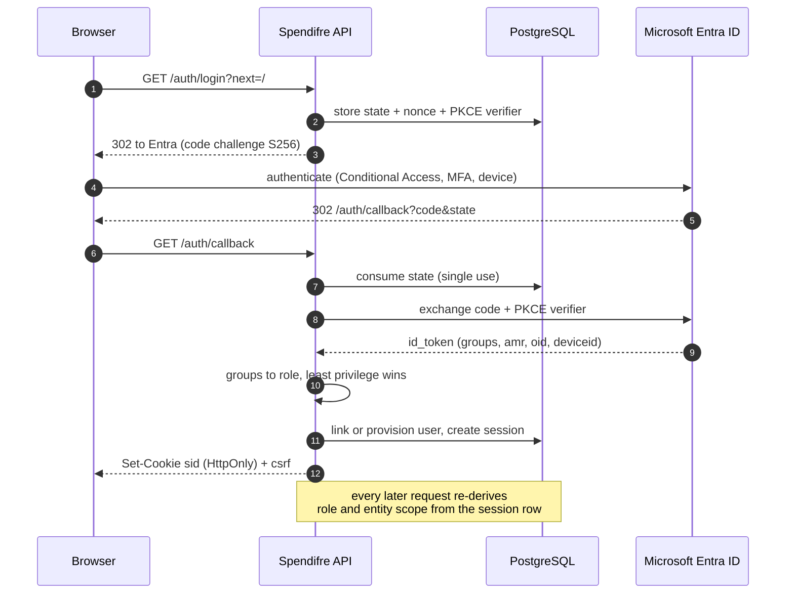

## Request lifecycle & authorisation gate

<sub>`flows/02-request-authorisation.mmd`</sub>

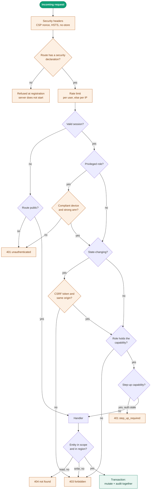

## Budget entry — grid edit round trip

<sub>`flows/03-budget-entry.mmd`</sub>

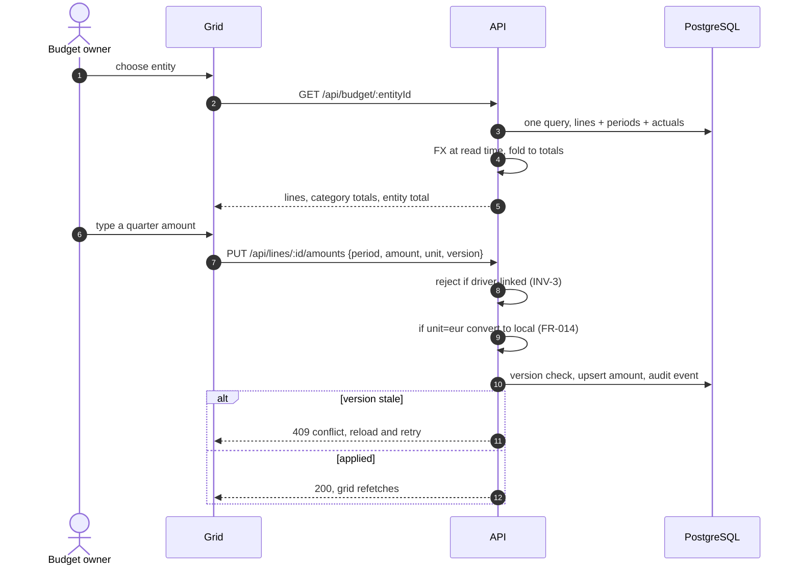

## Line detail, drivers and dormancy

<sub>`flows/04-line-detail-drivers.mmd`</sub>

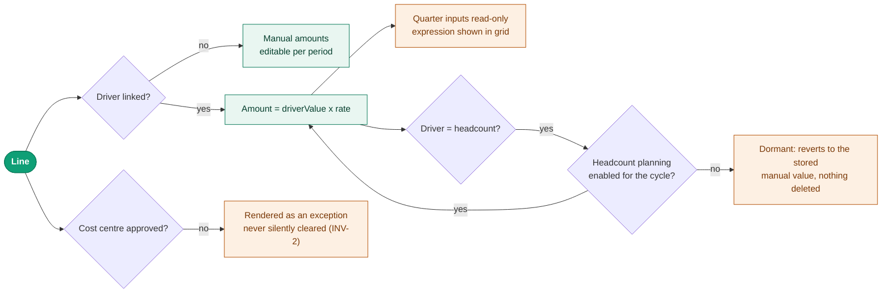

## Bulk operations over a selection

<sub>`flows/05-bulk-operations.mmd`</sub>

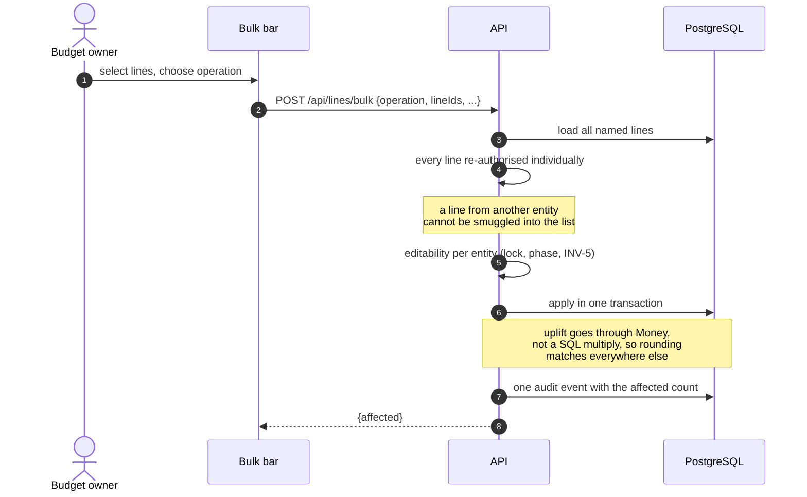

## Submission & approval state machine

<sub>`flows/06-submission-approval.mmd`</sub>

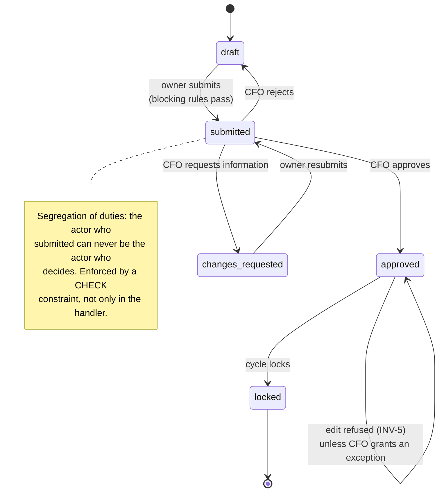

## Cost centre lifecycle & segregation of duties

<sub>`flows/07-cost-centre-lifecycle.mmd`</sub>

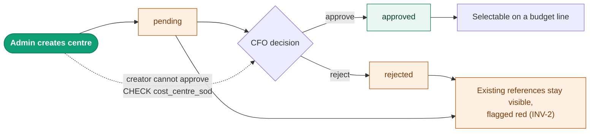

## Actuals, elapsed periods and pace

<sub>`flows/08-actuals-consumption.mmd`</sub>

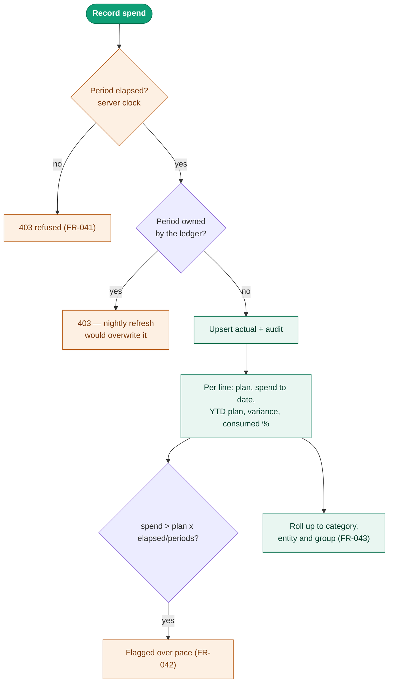

## FX restatement at read time

<sub>`flows/09-fx-restatement.mmd`</sub>

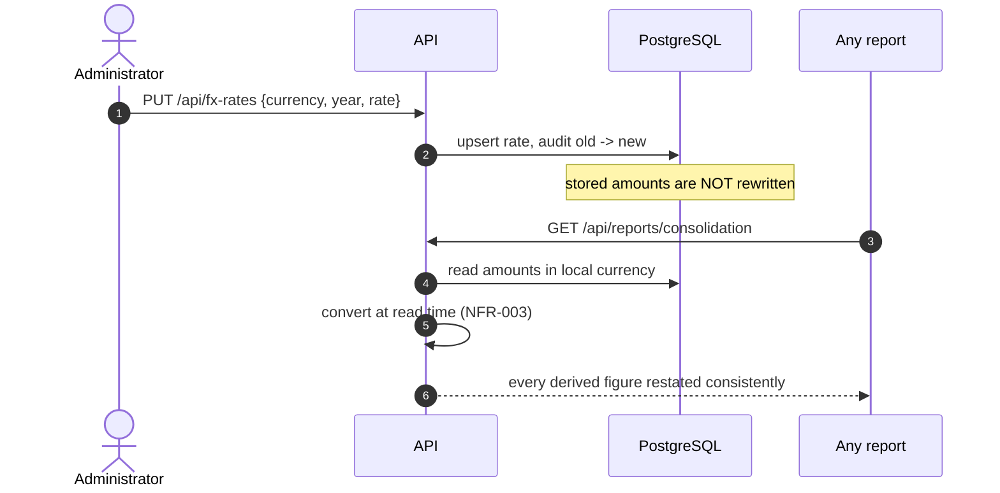

## Consolidation & the INV-4 fold

<sub>`flows/10-consolidation-reporting.mmd`</sub>

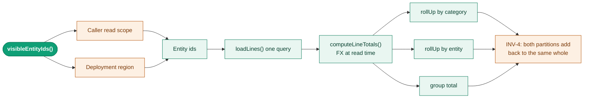

## Capex asset life & depreciation

<sub>`flows/11-capex-depreciation.mmd`</sub>

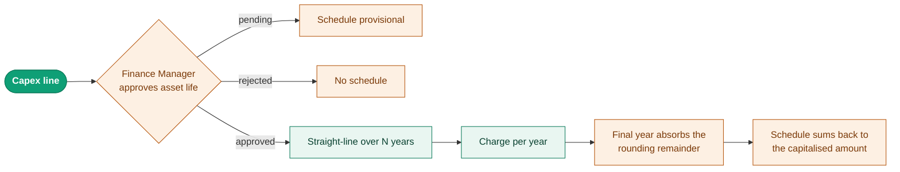

## Allocations & chargeback

<sub>`flows/12-allocations-chargeback.mmd`</sub>

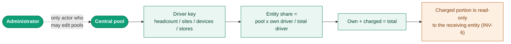

## Append-only audit & hash chain

<sub>`flows/13-audit-chain.mmd`</sub>

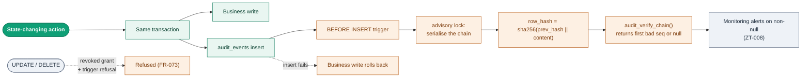

## Retention job & data subject rights

<sub>`flows/14-retention-dsr.mmd`</sub>

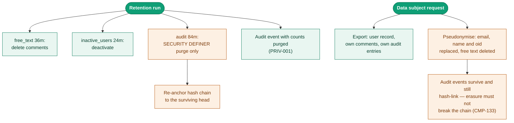

## Admin backup — encrypt, attest, download

<sub>`flows/15-backup.mmd`</sub>

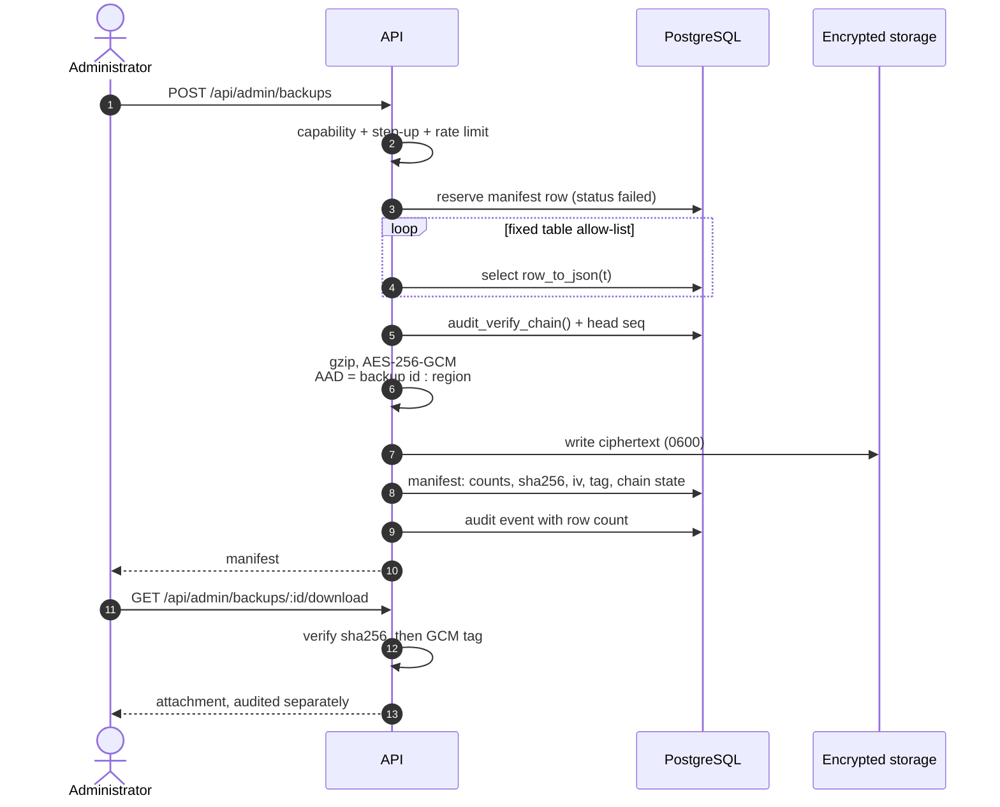

## XLSX export & formula-injection guard

<sub>`flows/16-export-xlsx.mmd`</sub>

```mermaid
graph LR
  REQ(["GET export.xlsx"]):::start --> CAP["budget.view.any<br/>+ 5 per 5 minutes"]:::ctrl
  CAP --> SCOPE["Scoped + region-filtered lines"]:::data
  SCOPE --> CELL{"Cell kind"}
  CELL -->|number| NUM["Money decimal string"]:::data
  CELL -->|text| ESC["Leading = + - @ tab CR<br/>prefixed with an apostrophe"]:::ctrl
  ESC --> XML["XML-escaped inline string"]:::data
  NUM & XML --> ZIP["OOXML zip, no library"]:::data
  ZIP --> DL["Content-Disposition attachment<br/>nosniff, fixed filename"]:::ctrl
  DL --> AUD["Audited with line and entity count"]:::ctrl
  classDef start fill:#0f9f76,stroke:#0b7a5a,color:#ffffff,font-weight:600;
  classDef ctrl fill:#fdf0e3,stroke:#b45309,color:#7a3908;
  classDef data fill:#e9f6f1,stroke:#0b7a5a,color:#08402f;
  classDef ext fill:#eef2f7,stroke:#55647c,color:#22303f;
```

## Residency routing (CMP-140)

<sub>`flows/17-residency-routing.mmd`</sub>

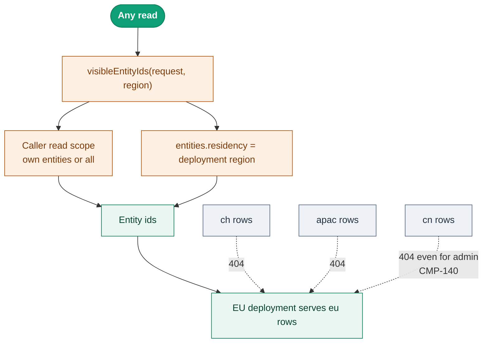

# User journeys

What each role actually does, in the order they do it.

## Budget owner

<sub>`flows/user-01-budget-owner.mmd`</sub>

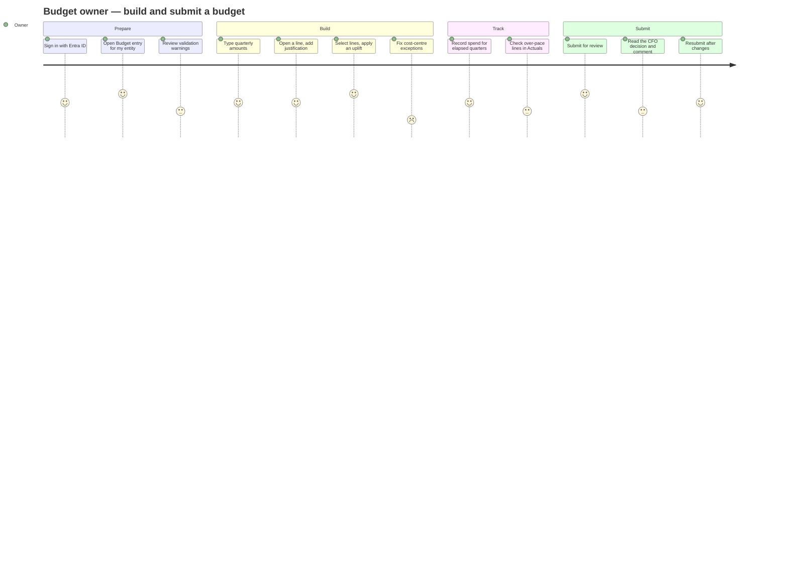

## CFO

<sub>`flows/user-02-cfo.mmd`</sub>

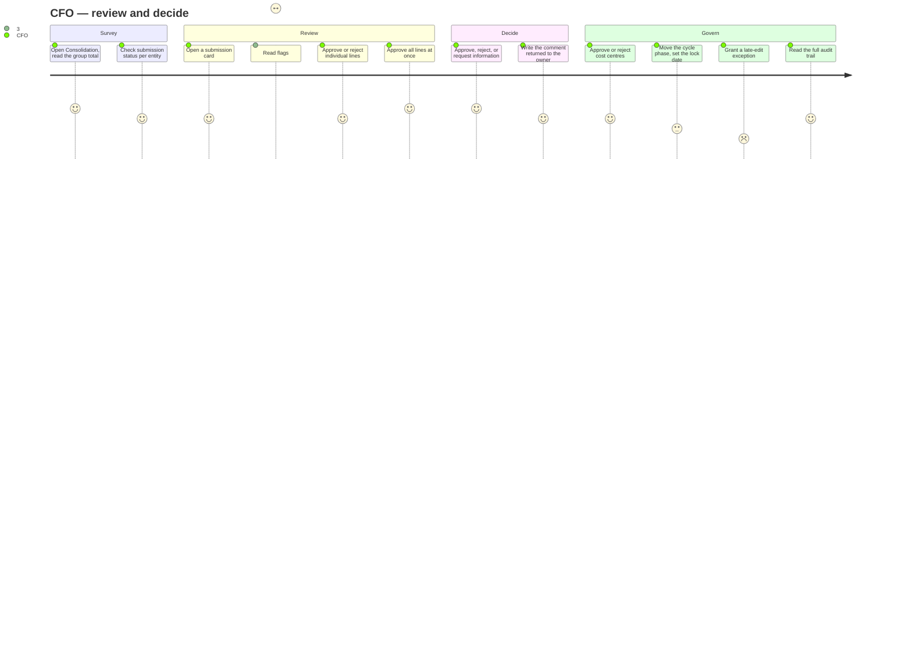

## Administrator (Group IT Finance)

<sub>`flows/user-03-administrator.mmd`</sub>

```mermaid
journey
  title Administrator — run the cycle
  section Template
    Define fields, order, required, visible: 4: Admin
    Set the approval threshold: 4: Admin
    Manage cost categories: 3: Admin
  section Organisation
    Create entities and assign owners: 4: Admin
    Create cost centres for CFO approval: 3: Admin
    Maintain FX rates: 4: Admin
    Edit allocation pools: 3: Admin
  section Governance
    Classify fields, set retention: 3: Admin
    Run the retention job: 2: Admin
    Handle a data subject request: 2: Admin
    Verify the audit chain: 5: Admin
  section Operations
    Run a backup: 5: Admin
    Export the consolidation: 5: Admin
```

## Finance Manager — the dual role

<sub>`flows/user-04-finance-manager.mmd`</sub>

```mermaid
journey
  title Finance Manager — the dual role
  section As a budget owner
    Build and submit my own entity: 4: FinanceMgr
    Record spend: 4: FinanceMgr
  section As a cycle co-owner
    Move the cycle phase: 3: FinanceMgr
    Set or clear the submission lock date: 3: FinanceMgr
    Grant a late-edit exception: 2: FinanceMgr
    Toggle validation rules: 3: FinanceMgr
  section Capex authority
    Approve or reject an asset life: 5: FinanceMgr
    Confirm the depreciation schedule: 4: FinanceMgr
```

# Software-development interaction

How the pieces interact at build, test, run and deploy.

## Change lifecycle — requirement to merge

<sub>`flows/dev-01-change-lifecycle.mmd`</sub>

```mermaid
graph LR
  REQ(["Requirement ID<br/>FR / SEC / ZT / PRIV"]):::start --> BR["Branch"]
  BR --> CODE["Code + comment naming the ID"]
  CODE --> TEST["Test that fails if the<br/>control is removed"]:::ctrl
  TEST --> PR["Pull request"]
  PR --> GATE["CI gates"]:::ctrl
  GATE --> REV["Review against the<br/>definition of done"]
  REV --> MERGE["Merge"]
  MERGE --> ADR{"Decision worth<br/>recording?"}
  ADR -->|yes| DOC["ADR in docs/adr"]:::data
  classDef start fill:#0f9f76,stroke:#0b7a5a,color:#ffffff,font-weight:600;
  classDef ctrl fill:#fdf0e3,stroke:#b45309,color:#7a3908;
  classDef data fill:#e9f6f1,stroke:#0b7a5a,color:#08402f;
  classDef ext fill:#eef2f7,stroke:#55647c,color:#22303f;
```

## CI gates

<sub>`flows/dev-02-ci-gates.mmd`</sub>

```mermaid
graph TB
  PR(["Pull request"]):::start --> TC["typecheck"]:::ctrl
  PR --> LINT["eslint<br/>incl. no concatenated SQL,<br/>no dangerouslySetInnerHTML"]:::ctrl
  PR --> AUD["npm audit high, prod deps"]:::ctrl
  PR --> BUILD["vite build"]:::ctrl
  PR --> TEST["vitest: authz matrix, security,<br/>invariants, a11y, operations"]:::ctrl
  PR --> SBOM["CycloneDX SBOM artefact"]:::data
  PR --> SAST["CodeQL security-extended"]:::ctrl
  PR --> SEC["gitleaks over full history"]:::ctrl
  PR --> CONF["Refuse any import of the<br/>confidential workbook"]:::ctrl
  TC & LINT & AUD & BUILD & TEST & SAST & SEC & CONF --> M{"All green?"}
  M -->|no| BLOCK["Merge blocked"]:::ctrl
  M -->|yes| OK["Mergeable"]:::data
  classDef start fill:#0f9f76,stroke:#0b7a5a,color:#ffffff,font-weight:600;
  classDef ctrl fill:#fdf0e3,stroke:#b45309,color:#7a3908;
  classDef data fill:#e9f6f1,stroke:#0b7a5a,color:#08402f;
  classDef ext fill:#eef2f7,stroke:#55647c,color:#22303f;
```

## Seed data & anonymisation boundary

<sub>`flows/dev-03-seed-anonymise.mmd`</sub>

```mermaid
graph LR
  RAW(["design/budget-data.js<br/>Confidential"]):::ext --> TOOL["tools/anonymise.ts<br/>offline only"]:::ctrl
  TOOL --> R1["Discard names and free text"]:::ctrl
  TOOL --> R2["Jitter then round amounts"]:::ctrl
  TOOL --> R3["Shuffle order"]:::ctrl
  TOOL --> R4["Report singleton classes"]:::ctrl
  R1 & R2 & R3 & R4 --> FIX["db/fixtures/anonymised.json<br/>Internal, gitignored"]:::data
  FIX --> DS{"SEED_MODE"}
  SYN["syntheticDataset()"]:::data --> DS
  DS --> LOADER["One loader, one Dataset"]:::data
  LOADER --> DB[("PostgreSQL")]:::data
  RAW -.->|CI refuses any import<br/>from packages/ or test/| X["Blocked"]:::ctrl
  classDef start fill:#0f9f76,stroke:#0b7a5a,color:#ffffff,font-weight:600;
  classDef ctrl fill:#fdf0e3,stroke:#b45309,color:#7a3908;
  classDef data fill:#e9f6f1,stroke:#0b7a5a,color:#08402f;
  classDef ext fill:#eef2f7,stroke:#55647c,color:#22303f;
```

## Test strategy

<sub>`flows/dev-04-test-strategy.mmd`</sub>

```mermaid
graph TB
  T(["360 tests"]):::start --> A["authz.test.ts<br/>every role x every capability"]:::ctrl
  T --> S["security.test.ts<br/>XSS, SQLi, CSRF, IDOR, headers,<br/>formula injection, config"]:::ctrl
  T --> I["invariants.test.ts<br/>INV-1..6, money, FX, concurrency"]:::ctrl
  T --> Y["a11y.test.ts<br/>axe in a real browser + contrast"]:::ctrl
  T --> O["operations.test.ts<br/>anonymiser, seed modes, backup"]:::ctrl
  A & S & I & Y & O --> PG[("Real PostgreSQL<br/>throwaway DB per run")]:::data
  PG --> WHY["Constraints, triggers and grants<br/>are half the controls — a mock<br/>would only test the mock"]:::ctrl
  classDef start fill:#0f9f76,stroke:#0b7a5a,color:#ffffff,font-weight:600;
  classDef ctrl fill:#fdf0e3,stroke:#b45309,color:#7a3908;
  classDef data fill:#e9f6f1,stroke:#0b7a5a,color:#08402f;
  classDef ext fill:#eef2f7,stroke:#55647c,color:#22303f;
```

## Runtime topology (target)

<sub>`flows/dev-05-runtime-topology.mmd`</sub>

```mermaid
graph TB
  subgraph edge["Public edge"]
    FD["Azure Front Door + WAF<br/>TLS 1.3 termination"]:::ext
  end
  subgraph private["Private network — no public ingress"]
    API["Container App: Spendifre API<br/>serves SPA shell + REST"]:::data
    PG[("Azure Database for PostgreSQL<br/>TLS verify-full, CMK at rest")]:::data
    BLOB[("Blob: backups<br/>CMK + immutability")]:::data
    KV["Key Vault<br/>DB creds, backup key, client secret"]:::ctrl
  end
  ENTRA["Microsoft Entra ID"]:::ext
  SIEM["SIEM / OTLP backend"]:::ext
  FD --> API
  API -->|workload identity| PG
  API -->|workload identity| BLOB
  API -->|managed identity| KV
  API -->|OIDC + PKCE| ENTRA
  API -->|auth, denials, admin actions| SIEM
  classDef start fill:#0f9f76,stroke:#0b7a5a,color:#ffffff,font-weight:600;
  classDef ctrl fill:#fdf0e3,stroke:#b45309,color:#7a3908;
  classDef data fill:#e9f6f1,stroke:#0b7a5a,color:#08402f;
  classDef ext fill:#eef2f7,stroke:#55647c,color:#22303f;
```

## Local development

<sub>`flows/dev-06-local-dev.mmd`</sub>

```mermaid
graph LR
  A(["npm ci"]):::start --> B["createdb spendifre"]
  B --> C["npm run db:migrate<br/>as the migrator role"]:::ctrl
  C --> D["npm run db:seed<br/>SEED_MODE=synthetic"]:::data
  D --> E["npm run build (web)"]
  E --> F["npm run dev<br/>DEV_AUTH=on"]:::ctrl
  F --> G["Sign in as any persona<br/>admin@ cfo@ finance@ ..."]
  F -.->|loadConfig refuses<br/>DEV_AUTH in production| H["Fails to start"]:::ctrl
  classDef start fill:#0f9f76,stroke:#0b7a5a,color:#ffffff,font-weight:600;
  classDef ctrl fill:#fdf0e3,stroke:#b45309,color:#7a3908;
  classDef data fill:#e9f6f1,stroke:#0b7a5a,color:#08402f;
  classDef ext fill:#eef2f7,stroke:#55647c,color:#22303f;
```
