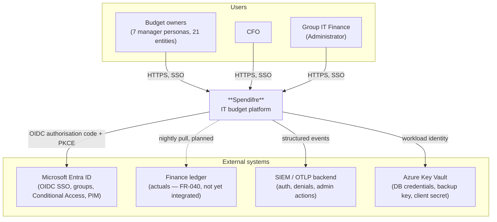
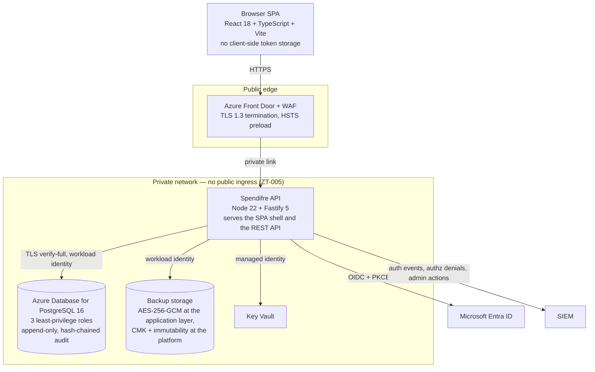
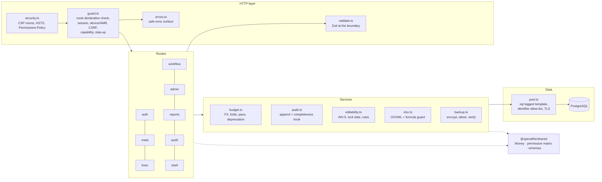
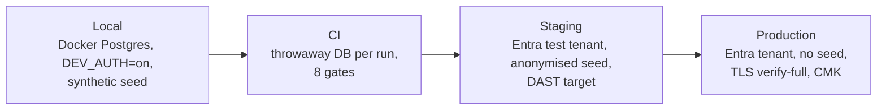
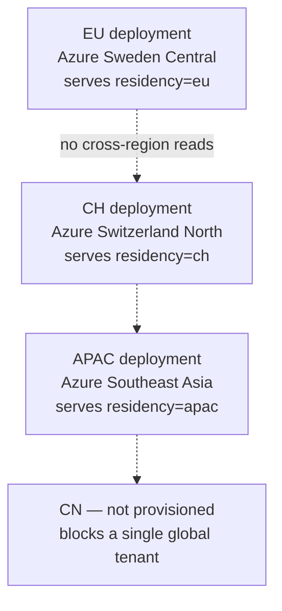

# Spendifre — High Level Design (HLD)

> Companion to the [LLD](./lld.md), [Building Blocks](./building-blocks.md) and
> [ADRs](../adr/). This document is the "big picture": what Spendifre is, how it
> is structured into deployable containers, how it integrates, and the quality
> attributes it targets.

## 1. Purpose & context

Spendifre is the **IT budget platform** for Birgma / Biltema Group (Nordic
retail). It replaces a 25-sheet Excel workbook with a role-aware web
application: Group IT Finance defines the template, budget owners across 21
entities fill in their lines, the CFO signs off line by line, and the group
consolidates in EUR at a year-locked FX rate.

The governing specification is `SPEC.md`, written for Spec Driven Development —
every behaviour is a numbered, testable requirement (`FR-`, `SEC-`, `ZT-`,
`PRIV-`, `NFR-`, `A11Y-`, `CMP-`). This HLD explains the shape; the spec remains
the contract.

### 1.1 System context (C4 — Level 1)

**Key points**

- Spendifre is the **system of record** for the budget cycle: plan, approval
  decisions and the audit trail.
- **Entra ID is authoritative for identity and role**. There is no local account
  store, no password reset path and no way for a request to assert a role;
  group claims map to one of nine roles at every sign-in.
- **Authorisation is enforced by Spendifre**, server-side, against the SPEC §5
  permission matrix encoded as data (ADR-0003). UI hiding is presentation only.
- The ledger integration is **specified but not built** (`FR-040`). Until it
  exists, recorded spend is the source, and the `actuals.source` column already
  distinguishes `manual` from `ledger` so the cutover is a feed, not a migration.

### 1.2 Actors and authority

| Actor | Entra group | Read scope | Write scope | Distinctive authority |
|---|---|---|---|---|
| Administrator (Group IT Finance) | `SG-Spendifre-Admin` | All | All | Template, entities, cost centres, FX, allocations, governance, backup |
| CFO | `SG-Spendifre-CFO` | All | — | Approve/reject submissions and lines, approve cost centres, cycle, governance |
| Finance Manager | `SG-Spendifre-Mgr-Finance` | All (read) | Own entity | **Sole** approver of capex asset lives; cycle co-owner |
| CIO / CTO / Global Infrastructure | `SG-Spendifre-CIO` / `-CTO` / `-Mgr-Infra` | All (read) | Own entity | — |
| Security / Architecture / PMO Manager | `SG-Spendifre-Mgr-Security` / `-Arch` / `-PMO` | Own entity | Own entity | — |

The CFO holds **no editing capability at all**. `SPEC.md` §12.5 records this as
an open question with Finance; §5 currently encodes "no" and a test asserts it,
so a change of mind fails loudly rather than drifting in.

## 2. Container view (C4 — Level 2)

**One container serves both the SPA shell and the API.** The shell is a static
HTML document with a per-response CSP nonce stamped onto its single script tag;
assets are read into memory at boot and served from a map keyed by exact
filename, so no request input ever reaches a filesystem path (ADR-0004).

### 2.1 Why an SPA rather than SSR

`SPEC.md` §2 suggests server-side rendering. We serve a static shell instead,
and the reason is `SEC-032`: a nonce-based CSP with no `unsafe-inline` forbids
inline `<style>` blocks **and** inline `style` attributes. SSR of a data-dense
grid pushes towards inlined state and inlined styles — exactly what the policy
refuses. A static shell has one nonce'd script tag and no inline anything.
Recorded in ADR-0001; revisit with measurement if first paint becomes a problem.

## 3. Component view (C4 — Level 3, API container)

`@spendifre/shared` is deliberately pure — no database, no request object — so
the permission matrix and the money type can be property-tested directly and
the same matrix drives the client's navigation without duplicating the rules.

## 4. Key architectural decisions

| # | Decision | Rationale |
|---|---|---|
| [0001](../adr/0001-stack.md) | TypeScript, Fastify, React, PostgreSQL, Entra | Fastify's `onRoute` hook lets an undeclared route fail at registration — `SEC-010` becomes a framework guarantee, not a review item |
| [0002](../adr/0002-money.md) | Money as scaled `bigint`, never float | `INV-4` cannot hold across a 500-line fold with binary floating point |
| [0003](../adr/0003-permission-matrix.md) | §5 normative; least privilege wins the §4/§5 ambiguity | Read scope and write scope are separate axes |
| [0004](../adr/0004-minimal-dependencies.md) | Replace a dependency when it is small, on a security boundary, and its tree is larger than the code it saves | Removed `exceljs` and `@fastify/static`; 6 direct production dependencies |
| [0005](../adr/0005-operations-and-seed-modes.md) | Anonymiser offline; backup encrypted and chain-attesting | Keeps "did production data reach non-production" a checkable question |
| [0006](../adr/0006-module-structure.md) | Routes by domain, services by layer | The domain grew past what one `admin.ts` could hold; the security-relevant code stays in three reviewable files |
| [0007](../adr/0007-modelling-depth.md) | Versions and driver trees, but no formula engine | A version dimension and a derived-driver tree are code the tests can hold to INV-4; a user-authored expression language is an interpreter for untrusted input and a second, unreviewed definition of every number |

## 5. Cross-cutting concerns

| Concern | Approach |
|---|---|
| **Identity** | Entra ID OIDC, authorisation code + PKCE. State, nonce and verifier held server-side and consumed on read. |
| **Authorisation** | Deny by default. Capability from the SPEC §5 matrix, entity scope re-derived from the session, region filter in the same resolver. |
| **Money** | `numeric(18,4)` end to end, `Money` value object over `bigint`, FX at read time from the FY-locked rate. |
| **Audit** | Append-only by grant, by trigger, and by SHA-256 hash chain. The audit insert shares the handler's transaction. |
| **Residency** | Every entity carries a region; the deployment carries its own; one resolver applies both. |
| **Errors** | One safe message per code. No stack trace, SQL text or received value ever serialised. |
| **Observability** | Structured JSON logs with credential redaction, request correlation ids, CSP violation sink. OTLP export is the named gap — see [observability](../observability.md). |
| **Accessibility** | WCAG 2.2 AA, axe in CI against the running app, palette contrast asserted arithmetically. |

## 6. Quality attributes (NFRs)

| Attribute | Target | Position |
|---|---|---|
| Performance (`NFR-001`) | 500-line grid < 1s, responsive while typing | Met. One query per grid; measured under 1s in CI. Re-measure at monthly granularity × versions. |
| Precision (`NFR-002`) | Fixed-precision money, no float | Met and enforced by lint (`parseFloat` banned) plus type design. |
| FX consistency (`NFR-003`) | Restating a rate restates every derived figure | Met. Conversion at read time; a test proves stored amounts do not move. |
| Reconciliation (`NFR-004`) | Parent = sum of children, every aggregate, every year | Met by property test over five years and two partitions. |
| Concurrency (`NFR-005`) | No silent overwrite | Met. Optimistic version token, 409 with a clear message. |
| Availability (`NFR-006`) | 99.5% in the collection window; tested backups; RTO/RPO | **Partial.** Backup exists and is verified; **restore is not implemented** — see §8. |
| Accessibility (`A11Y-001/2`) | WCAG 2.2 AA, no new axe violations | Met across eight views in a real browser. |
| i18n (`NFR-010`) | Locale-aware formatting | Partial. Formatting is locale-aware; strings are not externalised. |

## 7. Deployment & environments

`loadConfig` refuses, at startup, in production: `DEV_AUTH=on`, `RATE_LIMIT=off`,
a plaintext `PUBLIC_ORIGIN`, `DB_SSL_MODE=disable`, a non-synthetic `SEED_MODE`,
and absent Entra configuration. Each of those is a fail-closed cross-check with
a test, not a deployment convention.

### 7.1 Residency topology — the open decision

`SPEC.md` §12.1 and `CMP-140` are unresolved: a single global tenant is likely
not lawful for mainland China. The code is ready for either answer — entities
carry `residency`, the deployment carries `RESIDENCY_REGION`, and a mismatch
404s even for an administrator. The **decision** is still Legal's.

## 8. Known gaps

Stated here rather than left to be discovered:

- **Restore is not implemented.** Backup is; restore is deliberately absent
  because an untested restore path invites false confidence (`CMP-107`).
- **Ledger integration** (`FR-040`) — the largest functional gap.
- **OTLP telemetry** — structured logs exist, distributed tracing does not.
- **No IaC, no DAST run, no penetration test** (`SEC-041`).
- **Entra ID has never been exercised against a real tenant.** The adapter is
  written to the OIDC spec; the local development provider is what has been run.
- Deferred by the spec and since built at the product owner's request:
  versions and scenarios (`FR-080`), configurable approval stages (`FR-051`),
  template versioning (`FR-005`). What remains deliberately unbuilt is the
  formula engine — see [ADR 0007](../adr/0007-modelling-depth.md).

## 9. References

- `SPEC.md` — the contract
- [LLD](./lld.md) · [Building blocks](./building-blocks.md) · [ADRs](../adr/)
- [Threat model](../threat-model.md) · [Security hardening](../security-hardening.md)
- [Observability](../observability.md) · [Application evaluation](../application-evaluation.md)
- [Functional flows](../../SoW/flows.md)
