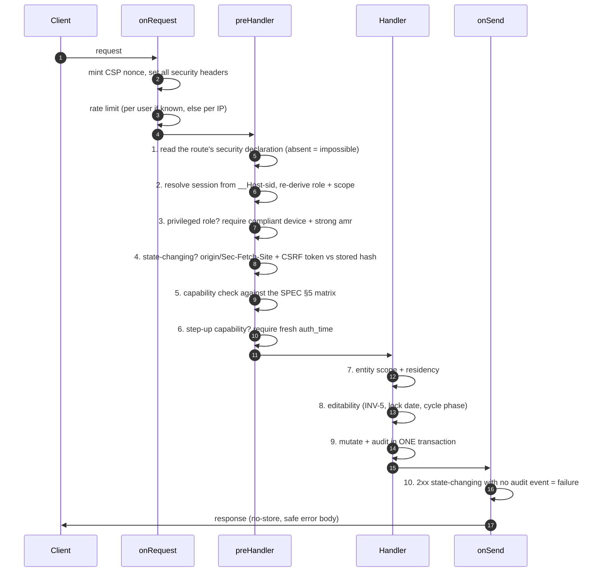
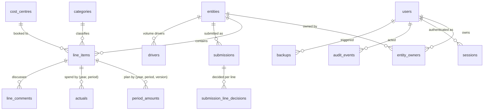

# Spendifre — Low Level Design (LLD)

> Companion to the [HLD](./hld.md). This document is the "how": solution
> structure, request lifecycle, data model, endpoint map, authorisation
> internals, and the algorithms that are easy to get wrong.

## 1. Solution structure

```
packages/shared/src    Money, permission matrix, domain types, Zod schemas — pure, no I/O
packages/api/src
  config.ts            environment schema + production fail-closed cross-checks
  app.ts               assembly order (this file is the security wiring)
  main.ts              process entrypoint, graceful shutdown
  auth/                session.ts (server-side sessions), oidc.ts (Entra + dev provider)
  http/                security.ts, guard.ts, errors.ts, validate.ts
  db/                  pool.ts (sql template), migrate.ts, seed.ts, dataset.ts
  routes/              auth, meta, lines, workflow, admin, reports, audit, shell
  services/            budget, audit, editability, xlsx, backup
packages/web/src       React SPA — api.ts, App.tsx, components/, styles/
db/migrations          001 core · 002 audit · 003 roles & grants · 004 backups
tools/                 anonymise.ts, capture-screens.mjs — offline, outside packages/
test/                  harness + authz, security, invariants, a11y, operations
```

Three directory boundaries are load-bearing rather than tidy:

- **`tools/` outside `packages/`** — the anonymiser may read the confidential
  workbook; the application may not, and CI greps `packages/` and `test/` to
  prove it. Keeping the tool outside means the gate needs no exception.
- **`db/` outside `packages/api`** — migrations run as a different database
  role. The directory boundary mirrors the privilege boundary.
- **`design/` is reference material** — prototypes and the workbook extract are
  never built, imported or deployed.

## 2. Request lifecycle & middleware order

Order is the security design, so `app.ts` spells it out rather than
auto-loading plugins:



**Step 1 cannot fail open.** `registerRouteDeclarationCheck` adds an `onRoute`
hook that *throws at registration time* when a route omits `config.security`.
A route without an authorisation decision cannot reach a running server.

```ts
app.addHook('onRoute', (routeOptions) => {
  if (routeOptions.method === 'HEAD') return;      // auto-generated from GET
  if (!routeOptions.config?.security) {
    throw new Error(`route ${routeOptions.method} ${routeOptions.url} has no security declaration`);
  }
});
```

**Step 10** is the audit-completeness hook: a 2xx response to a state-changing
method that wrote no audit event throws in development and test, and logs at
error level in production so the SIEM sees it.

## 3. Data model



### 3.1 Conventions that hold throughout

| Convention | Why |
|---|---|
| Identifiers are opaque UUIDv4 | Non-enumerable; removes the reconnaissance step (`SEC-011`) |
| Money is `numeric(18,4)` | No float column exists in the schema (`NFR-002`) |
| Rates are `numeric(18,8)` | VND 0.0000363, LAK, KRW round to nothing at 4 dp |
| Amounts keyed `(line, fiscal_year, period, budget_version)` | `FR-080` — and it was: migration 008 added the version table and the foreign key without touching a stored amount |
| Every free-text column has a length bound | Matches the boundary schema; bounds DoS and log injection |
| Amounts stored in the line's **local** currency | FX at read time so restatement is consistent (`NFR-003`) |

### 3.2 Constraints that are controls, not hygiene

```sql
-- SEC-012: the submitter can never be the approver.
constraint submission_sod check (decided_by is null or decided_by <> submitted_by)

-- SEC-012: the cost-centre creator can never approve it.
constraint cost_centre_sod check (approved_by is null or approved_by <> created_by)

-- INV-3: a driver link is all-or-nothing; no half-configured computed line.
constraint driver_link_complete check (
  (driver_key is null and driver_rate_per_unit is null) or
  (driver_key is not null and driver_rate_per_unit is not null))
```

### 3.3 The audit table

Three independent controls, because any one can be misconfigured:

1. **Grants** — `spendifre_app` holds `SELECT, INSERT` only. `UPDATE`/`DELETE`
   are revoked, so the attempt never reaches the trigger.
2. **Trigger** — `UPDATE` refused unconditionally; `DELETE` refused unless the
   retention GUC is set *and* the row is past its configured retention, so a
   leaked GUC still cannot purge recent history.
3. **Hash chain** — `row_hash = sha256(prev_hash || canonical content)`,
   anchored to a genesis value, serialised by an advisory lock.
   `audit_verify_chain()` returns the sequence of the first altered row, or
   null. Out-of-band tampering (a superuser, a doctored restore) is *detected*
   even though it cannot be prevented.

The one genuine conflict is `FR-073` ("never deletable, by anyone") against
`PRIV-001` ("enforce 84 months"). Resolved by `audit_purge_expired()`, a
`SECURITY DEFINER` function granted only to the retention role, which purges,
then **re-anchors the chain** to the surviving head so verification still starts
from a recorded value.

## 4. Endpoint map

Every route's declared capability. `public` = deliberately unauthenticated;
`auth` = any authenticated principal, scoped inside the handler.

| Method | Path | Declaration | Notes |
|---|---|---|---|
| GET | `/auth/login` · `/auth/callback` | public | 10/min |
| POST | `/auth/logout` | auth | |
| GET | `/api/me` | auth | bootstrap payload |
| GET | `/api/cycle` · `/api/categories` · `/api/entities` · `/api/cost-centres` · `/api/fx-rates` · `/api/drivers` | auth | scoped in query |
| GET | `/api/budget/:entityId` | auth | + read scope + region |
| GET | `/api/lines/:lineId` | auth | + read scope + region |
| POST | `/api/lines` | `budget.line.edit.own` | |
| PATCH·DELETE | `/api/lines/:lineId` | `budget.line.edit.own` | version token |
| PUT | `/api/lines/:lineId/amounts` | `budget.line.edit.own` | refuses driver-linked |
| PUT·DELETE | `/api/lines/:lineId/driver` | `budget.line.edit.own` | |
| POST | `/api/lines/bulk` | `budget.line.edit.own` | 20/min |
| PUT | `/api/lines/:lineId/actuals` | `actuals.record` | elapsed periods only |
| POST | `/api/lines/:lineId/comments` | `budget.line.edit.own` | |
| POST | `/api/lines/:lineId/asset-life` | `capex.approveAssetLife` | Finance Manager only |
| GET | `/api/entities/:entityId/validation` | auth | |
| POST | `/api/entities/:entityId/submit` | `budget.submit` | blocking rules server-side |
| GET | `/api/submissions` | auth | |
| POST | `/api/submissions/:id/decision` | `submission.decide` | **step-up** |
| POST | `/api/submissions/:id/lines/:lineId/decision` | `submission.decideLine` | |
| POST | `/api/submissions/:id/approve-all-lines` | `submission.decideLine` | |
| POST | `/api/cycle/phase` · `/api/cycle/lock` | `cycle.phase` | **step-up** |
| POST·GET | `/api/cycle/exceptions` | `cycle.exception` / auth | **step-up** on write |
| GET·PATCH | `/api/validation-rules` | auth / `cycle.rules` | |
| POST | `/api/cycle/headcount-planning` | `cycle.rules` | |
| POST·GET | `/api/reminders` | `template.define` / auth | |
| GET·PATCH | `/api/template/fields` | auth / `template.define` | |
| POST | `/api/template/threshold` · `/api/categories` | `template.define` | |
| POST | `/api/cost-centres` | `costCentre.create` | |
| POST | `/api/cost-centres/:id/decision` | `costCentre.approve` | |
| POST·DELETE | `/api/entities` | `entity.manage` | **step-up** |
| PUT | `/api/fx-rates` | `fx.edit` | |
| PUT | `/api/drivers` | `budget.line.edit.own` | |
| GET·PUT | `/api/allocations` | auth / `allocation.edit` | |
| GET·PUT | `/api/governance/classifications` · `/retention` | auth / `governance.edit` | **step-up** on write |
| GET | `/api/governance/subject/:userId/export` | `governance.edit` | **step-up** |
| POST | `/api/governance/subject/:userId/pseudonymise` | `governance.edit` | **step-up** |
| POST | `/api/governance/retention/run` | `governance.edit` | **step-up** |
| GET | `/api/governance/audit-integrity` | `audit.viewAll` | |
| GET | `/api/reports/consolidation` · `/trend` · `/variance` · `/consumption` · `/capex` · `/fx-history` · `/allocations` | auth | scoped before aggregation |
| GET | `/api/reports/export.xlsx` | `budget.view.any` | 5 / 5 min, audited |
| POST·GET | `/api/admin/backups` | `backup.run` | **step-up**, 3 / 10 min |
| GET | `/api/admin/backups/:id/download` | `backup.download` | **step-up**, 5 / 10 min |
| GET | `/api/audit` | auth | scope decided by `audit.viewAll` |
| GET | `/` · `/app/*` · `/assets/:file` · `/healthz` | public | |
| POST | `/api/security/csp-report` | public | 60/min |

## 5. Authorisation internals

Two axes, deliberately separate:

```ts
can(role, capability)              // may this role do this at all?
canReadEntity(principal, id)       // may it read here?   scope 'all' | 'own'
canWriteEntity(principal, id)      // may it write here?  scope 'all' | 'own'
```

Holding a capability is necessary but not sufficient. `readScope` is `all` for
Admin, CFO, Finance Manager, CIO, CTO and Infrastructure; `writeScope` is `all`
for Admin alone. That split is the §4/§5 resolution in ADR-0003.

**Failure modes are chosen, not accidental:**

| Situation | Response | Why |
|---|---|---|
| No session | 401 | |
| Role lacks the capability | 403 | The caller knows what they asked for |
| Entity out of **read** scope | **404** | 403 would confirm the identifier exists |
| Entity out of **write** scope | 403 | Naming the object already proves it exists |
| Entity in another region | **404** | Same reasoning, applied to `CMP-140` |
| Step-up capability, stale `auth_time` | 401 `step_up_required` | Distinguishable so the client can prompt |

### 5.1 Sessions

The cookie carries a random opaque token and nothing else — no claims, no role,
no scope. Only `sha256(token)` is stored, so a database read yields no usable
session. `auth_time` is the time of the last **primary** authentication, so
step-up compares against that rather than against session age.

## 6. Cross-cutting services

### 6.1 `db/pool.ts` — the injection boundary

```ts
const rows = await db.query(sql`
  select id from line_items where entity_id = ${entityId} and deleted_at is null
`);
```

`sql` is a tagged template that pushes every interpolated value into the bind
array. A nested `sql` fragment has its placeholders renumbered into the parent
statement, so composition stays parameterised. The one place parameterisation
does not help — dynamic `ORDER BY`, table and column names — is served by
`identifier(candidate, allowList)`, which compares by **equality** against the
caller's list and then re-checks the shape. `raw()` exists but is not exported.

TLS is explicit (`DB_SSL_MODE`), because `node-postgres` does not negotiate it
otherwise and `require` alone does not validate the certificate.

### 6.2 `services/budget.ts` — the fold

Everything reconciles because everything is the same fold:

```ts
const totals   = computeLineTotals(lines, fx, headcountPlanning, periods);
const byCat    = rollUp(lines, totals, l => l.categoryId);
const byEntity = rollUp(lines, totals, l => l.entityId);
const group    = Money.sum(totals.map(t => t.eur));
```

There is no stored parent figure anywhere. `INV-4` is a property test over two
independent partitions across five years.

**`effectivePeriodAmount`** is where `INV-3` lives: a driver-linked line's
amount is computed from `driverValue × rate` and never read from storage, so the
stored figure cannot drift from the formula. The annual figure is spread evenly
with the **remainder given to the final period**, so quarters still sum exactly
to the annual total (`INV-1`).

### 6.3 `services/xlsx.ts` — the export boundary

An OOXML + ZIP writer with no dependency, because the export is where our data
crosses into someone else's Excel. Every text cell passes
`escapeSpreadsheetValue`, which prefixes a leading `=`, `+`, `-`, `@`, tab or CR
with an apostrophe — preserving the value while making it inert. Numeric cells
carry a `Money` decimal string, never a JS number.

### 6.4 `services/backup.ts`

Tables come from a **fixed allow-list**, not `information_schema`: a new table
is absent from backups until someone adds it, which is the failure that gets
noticed. `sessions` and `auth_transactions` are excluded — live credentials, not
records. The GCM AAD binds ciphertext to `(backup id, region)`, so a blob moved
between manifests or restored into the wrong region fails to decrypt.

## 7. Algorithms worth stating

### 7.1 Money rounding

Half away from zero, applied **once** per operation:

```ts
multiplyByRate(rate)  // units × rateUnits ÷ 10^rateScale, rounded once at the end
divideByRate(rate)    // units × 10^rateScale ÷ rateUnits, same rounding
```

Rate precision is not truncated before the multiply, so a value multiplied and
then divided does not drift twice.

### 7.2 Elapsed periods and pace

Elapsed periods come from the **server** clock, never the client:

```
elapsed   = min(periodsInYear, ceil(monthsElapsed / (12 / periodsInYear)))
overPace  = actual > plan × elapsed / periodsInYear
```

A zero plan with any spend is over pace by definition.

### 7.3 Depreciation

Straight line over the approved asset life, with the **final year absorbing the
rounding remainder** so the schedule sums back to the capitalised amount exactly.

### 7.4 Allocation share

`share = pool × ownDriverValue / totalDriverValue`, computed in EUR through
`Money`, read-only to the receiving entity (`INV-6`).

## 8. Frontend design (salient points)

- **No token in `localStorage`.** There is no token to store: authentication is
  entirely cookie-borne. `api.ts` reads only the CSRF cookie and echoes it in
  `x-csrf-token`.
- **No inline styles anywhere**, because the CSP forbids them. The bar charts
  are SVG `<rect width>` — a presentational attribute, not CSS — precisely
  because a React `style={{ width }}` prop would not render under the policy.
- **Navigation is built from the capability matrix**, but that is presentation.
  Every route behind it re-checks server-side, and the code is written assuming
  a user can call any endpoint by hand.
- **The grid is a real `<table>`** with `<caption>`, `scope="col"`,
  `scope="rowgroup"` category bands and a hidden label per amount input, so a
  screen reader announces "row 4, Q2, 12 400" rather than a wall of divs.
- **Every status carries a glyph as well as a colour** (`A11Y-001`), and scroll
  containers carry `tabindex` so a keyboard user can scroll them.

## 9. Testing strategy

| Suite | What it proves |
|---|---|
| `authz.test.ts` | Every (role × capability) pair — 203 assertions driven from the matrix itself, so a new capability without a probe fails the suite |
| `security.test.ts` | Stored XSS round-trips, SQLi, CSRF, IDOR 404, SoD at the database level, audit immutability and tamper detection, rate limiting, headers, open redirect, config fail-closed, no information leakage |
| `invariants.test.ts` | `INV-1`–`INV-6`, money precision, FX restatement, optimistic concurrency, pace, depreciation, audit rollback |
| `a11y.test.ts` | axe (WCAG 2.2 AA) across eight views in a real browser, palette contrast arithmetic, type-scale floor, grid payload budget |
| `operations.test.ts` | Anonymiser per re-identification route, seed modes, backup encryption/integrity/attestation/step-up |

Tests run against a **real PostgreSQL** with a throwaway database per run.
Constraints, triggers and grants are half the controls; a mock would only prove
the mock behaves as written.
