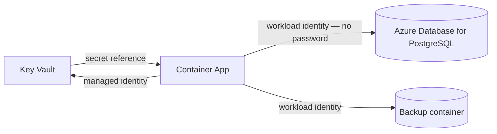

# Secrets handling

**No secret in Spendifre has a default value.** `loadConfig` validates the
environment at startup and refuses to run without what it needs, so the class of
bug where a staging box quietly runs with a well-known signing key cannot occur
(`ZT-006`).

There is no credential, token or connection string anywhere in source. CI runs
`gitleaks` over full history, not just the diff.

---

## 1. The complete inventory

| Variable | What it is | Required | If absent |
| --- | --- | --- | --- |
| `DATABASE_URL` | Application role connection string | Always | Startup fails |
| `MIGRATION_DATABASE_URL` | Migrator role — holds DDL | Migrations only | Migration fails |
| `TELEMETRY_SALT` | Salt for IP / user-agent hashes | Always | Startup fails (min 16 chars) |
| `ENTRA_TENANT_ID` / `ENTRA_CLIENT_ID` | Entra application identity | Production | Startup fails |
| `ENTRA_CLIENT_SECRET` | Entra client secret | Production | Startup fails |
| `BACKUP_ENCRYPTION_KEY` | 32 bytes hex, AES-256-GCM | For backups | Backups refused — **never** written unencrypted |
| `DB_CA_CERT` | CA for `verify-full` | If the DB uses a private CA | Falls back to the platform trust store |

Not secrets, but security-relevant configuration with fail-closed behaviour in
production: `DEV_AUTH`, `RATE_LIMIT`, `PUBLIC_ORIGIN`, `DB_SSL_MODE`,
`SEED_MODE`, `RESIDENCY_REGION`, `SERVED_REGIONS`, `REPLICA_COUNT`.

## 2. Local development

`.env` is gitignored; `.env.example` is the template and holds **no values**.

```bash
cp .env.example .env
openssl rand -hex 32       # BACKUP_ENCRYPTION_KEY
openssl rand -hex 32       # TELEMETRY_SALT
```

The local database password is deliberately obvious (`devonly_…`) and supplied
out of band. It is not a secret and should never resemble one — a
realistic-looking development password is how a real one eventually gets
committed.

`DEV_AUTH=on` enables a local sign-in stub. It is refused in production by
`loadConfig`, so the route does not exist in a deployed environment rather than
merely being guarded inside.

## 3. Azure — the target



Two levels, in order of preference:

**Preferred — no secret at all.** Azure Database for PostgreSQL supports Entra
authentication: the container app's managed identity obtains a token and there
is no password to rotate, leak or scan for. This is the target state and removes
`DATABASE_URL`'s password entirely.

**Otherwise — Key Vault references.** Container Apps resolve
`@Microsoft.KeyVault(SecretUri=...)` at start, so the secret never appears in an
image, a manifest or a pipeline variable.

```bash
az keyvault secret set --vault-name spendifre-kv --name backup-encryption-key \
  --value "$(openssl rand -hex 32)"
```

## 4. Rotation

| Secret | Cadence | Procedure | Impact |
| --- | --- | --- | --- |
| `BACKUP_ENCRYPTION_KEY` | Annually, or on suspicion | See below — **read this before rotating** | Old backups become unreadable |
| `ENTRA_CLIENT_SECRET` | Per Entra policy (≤ 24 months) | Add a second credential, deploy, remove the first | None if overlapped |
| Database password | Quarterly, or move to Entra auth | Rotate in Key Vault, restart | Brief connection churn |
| `TELEMETRY_SALT` | Rarely | Rotate freely | Session-relocation detection resets; nothing else |

### Rotating the backup key — the one that bites

Backups are encrypted with the key **current at the time of creation**. Rotating
it does not re-encrypt existing archives; it makes them undecryptable.

Before rotating: decide whether archives inside the 24-month retention window
must remain readable. If they must, retain the previous key in Key Vault (a
disabled version is still retrievable) and record which backup ids it covers.
The manifest's `created_at` is what maps a backup to a key era.

A key-id column on `backups` would make this self-describing. It is not
implemented — noted here because the operational hazard is real today.

## 5. What is deliberately not stored

| Not stored | Instead |
| --- | --- |
| Session tokens | `sha256(token)` only — a database read yields no usable session |
| CSRF tokens | `sha256(token)` only |
| Passwords | None exist. Identity is Entra-only; there is no local account and no reset path |
| OIDC code verifier | Server-side for the transaction's lifetime, consumed on read; never in a cookie |
| Client IP / user-agent | Salted SHA-256 (`CMP-132` minimisation) |

## 6. Incident response — suspected exposure

1. **Rotate first, investigate second.**
2. `BACKUP_ENCRYPTION_KEY`: rotate, then treat every archive within retention as
   exposed. The manifests give you the exact list, sizes and row counts.
3. `ENTRA_CLIENT_SECRET`: rotate in Entra, then revoke live sessions —
   `revokeAllForUser` per principal, or truncate `sessions`.
4. Database credential: rotate in Key Vault, restart, then check
   `audit_verify_chain()`. A break means someone reached the database directly.
5. Search history: `gitleaks detect --log-opts="--all"`. Remember that a
   rewrite does not un-disclose anything already pushed.
