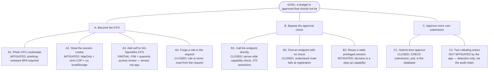
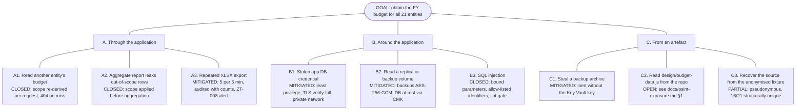

# Threat model — Spendifre

`SEC-042` requires a STRIDE model per epic, reviewed whenever a trust boundary
moves. This is the baseline model for v1. It is written to be *falsifiable*:
every mitigation names the control that implements it and, where one exists, the
test that fails if the control is removed.

| | |
|---|---|
| **System** | Spendifre — Birgma / Biltema Group IT budget platform |
| **Version** | v1 core, as implemented |
| **Method** | STRIDE per trust boundary · LINDDUN for privacy · MITRE ATT&CK mapping · attack trees for the highest-value goals |
| **Last reviewed** | At implementation of the v1 core |
| **Next review trigger** | Any change to the boundaries in §2 — a new ingress, a new processor, a new region, or a change to how identity is established |

## 1. Scope & assumptions

**In scope.** The application (API + SPA), its PostgreSQL store, the Entra ID
integration, the XLSX export, and the backup artefact.

**Out of scope, and assumed sound.** Azure platform security, the Entra tenant's
Conditional Access and PIM configuration, corporate endpoint management, and
physical security. Where the application *depends* on one of these it re-checks
the result rather than trusting it — privileged roles have their device
compliance and `amr` re-verified per request precisely so a policy gap fails
closed.

**Assumed hostile.** The browser, the network, every request body, and any
authenticated user acting outside their remit.

---

## 2. Assets & security objectives

Ranked by what an attacker would actually want, not by CVSS.

| Asset | Why it is a target | Classification |
|---|---|---|
| FY budget figures across 21 entities | Pre-publication commercial position of a retail group: vendor spend, contract values, headcount plans | `Confidential` |
| Vendor names and contract values | Reveals supplier relationships and negotiating position | `Confidential` |
| Approval decisions and the audit trail | Financial-control evidence; forging or erasing it defeats `CMP-150` | `Confidential` |
| Budget owners, approvers, comment authors | Personal data under GDPR and revFADP | `Personal data` |
| Headcount driver values | Personal-data-adjacent at entity granularity; profiling risk (`CMP-134`) | `Confidential` |
| Entra ID sessions for CFO / Admin | Privilege: approve budgets, change retention, purge data | — |

The single highest-value action for an attacker is **approving a budget as the
CFO**, because it converts a compromise into a financial-control failure that
looks legitimate in the record.

---

## 3. System decomposition & trust boundaries

```
   ┌─ Internet ──────────────────────────────────────────────────────────┐
   │  browser (untrusted)                                               │
   └───────────────┬────────────────────────────────────────────────────┘
                   │  TLS 1.3, session cookie, CSRF token         [B1]
   ┌───────────────▼────────────────────────────────────────────────────┐
   │  Azure Front Door / WAF                                            │
   └───────────────┬────────────────────────────────────────────────────┘
                   │  private network only                        [B2]
   ┌───────────────▼────────────────────────────────────────────────────┐
   │  API (Fastify)                                                     │
   │    guard: session → device/AMR → CSRF → capability → step-up       │
   │    handler: entity scope → editability → mutate + audit (one tx)   │
   └──────┬──────────────────────────┬──────────────────────────────────┘
          │ workload identity  [B3]  │ OIDC + PKCE                 [B4]
   ┌──────▼───────────┐       ┌──────▼───────────┐
   │  PostgreSQL      │       │  Entra ID        │
   │  3 roles, RLS-by │       │  Conditional     │
   │  -query, audit   │       │  Access, PIM     │
   │  append-only     │       └──────────────────┘
   └──────┬───────────┘
          │ [B5]
   ┌──────▼───────────────────────────────────────────────────────────┐
   │  XLSX export → the recipient's Excel (a boundary we do not own)   │
   └───────────────────────────────────────────────────────────────────┘
```

`B5` is the boundary most often forgotten. An export leaves our control entirely
and executes in someone else's spreadsheet, which is why formula injection is
treated as a first-class finding rather than an output-formatting nicety.

---

## 4. STRIDE analysis

### B1 — Browser → API

| # | STRIDE | Threat | Mitigation | Verified by |
|---|---|---|---|---|
| 1.1 | Spoofing | Stolen session cookie replayed | Opaque token, SHA-256 at rest, `HttpOnly`+`Secure`+`SameSite=Lax`+`__Host-`, absolute TTL, revocation on risk (`SEC-034`, `ZT-007`) | `security.test.ts` cookie/CSRF blocks |
| 1.2 | Spoofing | Client asserts a role or entity scope in the request | Nothing is read from the client: role and scope are re-derived from the session row per request (`SEC-011`) | `authz.test.ts` (270 assertions) |
| 1.3 | Tampering | CSRF from a malicious site | Session-bound CSRF token compared against a stored hash, **plus** an origin / `Sec-Fetch-Site` check, **plus** `SameSite` | `SEC-034 CSRF and origin` |
| 1.4 | Tampering | Stored XSS via justification, comment, information request, cost-centre description, reminder | Context-escaping renderer, no `dangerouslySetInnerHTML`, strict CSP with per-response nonce, no `unsafe-inline`/`unsafe-eval` (`SEC-030`–`SEC-032`) | 10 payload round-trips; axe run proves the CSP is live because it blocks axe's own injection |
| 1.5 | Information disclosure | ID enumeration across entities | Opaque UUIDs; out-of-scope reads return **404**, not 403 (`SEC-011`) | `returns 404, not 403` |
| 1.6 | Information disclosure | Stack traces, SQL text, driver messages in responses | One safe message per error code; detail only to the log; framework 4xx translated rather than surfaced | `Error responses do not leak internals` |
| 1.7 | Denial of service | Request flood, oversized body, bulk-op abuse | Per-user/per-IP limits, tighter limits on auth/export/bulk, 512 KB body cap, DB statement timeout (`SEC-013`) | `SEC-013 rate limiting` |
| 1.8 | Elevation | Open redirect used to phish a session | Redirect targets normalised to single-slash relative paths | `SEC-035 open redirect` (7 cases) |

### B2 — Edge → API

| # | STRIDE | Threat | Mitigation |
|---|---|---|---|
| 2.1 | Spoofing | Forged `X-Forwarded-For` to evade per-IP limits | `trustProxy: 1` — only the immediate hop is believed |
| 2.2 | Tampering | Direct-to-origin request bypassing the WAF | API has no public ingress; private networking only (`ZT-005`) |
| 2.3 | Information disclosure | Framework/version fingerprinting | `X-Powered-By` removed; uniform error bodies |

### B3 — API → PostgreSQL

| # | STRIDE | Threat | Mitigation | Verified by |
|---|---|---|---|---|
| 2.9 | Tampering | A code path rewrites a **published** template, changing the field set an already-approved budget was completed against | The route refuses it, and since migration 012 so does the database: statement-level triggers refuse any write to a published version's fields, a field moved into one, and any change to or deletion of the version row — unpublishing included (`FR-005`) | `features.test.ts` attempts both out of band |
| 2.10 | Elevation | A new endpoint ships without an authorisation declaration, or with one that does not fire | `onRoute` refuses to register an undeclared route, and the attack suite sweeps **every** route the running instance registers — unauthenticated, then as a role that lacks the capability — so the control is re-proved against the route table rather than against a list someone maintains (`SEC-010`) | `pentest.test.ts`; verified failing by marking `/api/entities` public |
| 3.1 | Tampering | SQL injection | Every statement built by a tagged template that binds values; a template literal cannot decay into concatenation. Dynamic `ORDER BY`/identifiers come from an equality allow-list (`SEC-020`) | `SEC-020 injection` |
| 3.2 | Tampering | Compromised app role alters or deletes audit history | `spendifre_app` holds `SELECT, INSERT` only on `audit_events`; `UPDATE`/`DELETE` revoked **and** refused by trigger (`SEC-021`, `FR-073`) | `FR-073 audit immutability` |
| 3.3 | Tampering | Privileged out-of-band tampering (superuser, restored backup) | SHA-256 hash chain per row anchored to a genesis value; `audit_verify_chain()` pinpoints the first altered row | `detects tampering performed with the trigger disabled` |
| 3.4 | Repudiation | An actor denies making a change | Every state-changing handler writes an audit event in the *same transaction*; an audit failure rolls the change back | `rolls the change back when the audit write fails` |
| 3.5 | Elevation | Application performs DDL | No `CREATE` on schema, migrations run as a separate role | migration/grants split |
| 3.6 | Information disclosure | Cross-entity data returned by an aggregate query | Scope applied *before* aggregation, in one resolver every read path calls | `SEC-011` block + residency test |

### B4 — API → Entra ID

| # | STRIDE | Threat | Mitigation |
|---|---|---|---|
| 4.1 | Spoofing | Authorisation-code interception | Authorisation code flow with PKCE S256; verifier held server-side, never in a cookie |
| 4.2 | Tampering | Replayed callback | `state` and `nonce` stored server-side and consumed on read — single use |
| 4.3 | Elevation | Group-claim sprawl grants more than intended | Multiple role groups resolve to the **least** privileged (`ZT-004`) | `takes the least privileged role` |
| 4.4 | Elevation | Account takeover via email collision | Identity is the Entra `oid`. Pre-provisioned rows are claimable only while `entra_oid is null`, so an established account can never be claimed by a second principal presenting the same address |
| 4.5 | Spoofing | Privileged role signs in from an unmanaged device or without phishing-resistant MFA | Conditional Access enforces it; the app **re-checks** `amr` and device compliance per request and fails closed (`ZT-002`, `ZT-003`) |

### B5 — Export → recipient's spreadsheet

| # | STRIDE | Threat | Mitigation | Verified by |
|---|---|---|---|---|
| 5.1 | Elevation (on the recipient) | CSV/XLSX formula injection: a vendor name of `=cmd\|'/c calc'!A1` executes when the CFO opens the pack | Leading `=`, `+`, `-`, `@`, tab and CR are prefixed with `'`; the value is preserved, not stripped (`SEC-023`) | 7 escaping cases **plus** inflating the real workbook and asserting the sheet XML |
| 5.2 | Information disclosure | Mass export as exfiltration | Export requires `budget.view.any`, is rate limited to 5 per 5 minutes, and is audited with the row and entity count for SIEM alerting (`ZT-008`) | `SEC-013 rate limiting` |

### B6 — Backup archive → storage and operator (added with ADR 0005)

A backup is the single most concentrated asset the system produces: every
figure, every comment, every personal record and the whole audit trail in one
file, outside the database's access controls.

| # | STRIDE | Threat | Mitigation | Verified by |
|---|---|---|---|---|
| 6.1 | Information disclosure | Archive stolen from storage or a misconfigured volume | AES-256-GCM with a key from the environment (Key Vault in production), never stored beside the archive. A deployment without a key refuses to create a backup rather than writing plaintext | `writes only ciphertext to disk` |
| 6.2 | Tampering | Archive modified before restore | SHA-256 of the ciphertext verified before decryption, GCM auth tag during it — two independent failures rather than partially-trusted plaintext | `detects a tampered archive` |
| 6.3 | Tampering | Blob swapped between manifests, or restored into another region | The AAD binds ciphertext to `(backup id, region)`, so a mismatch fails to decrypt; region is also checked on read (CMP-140) | `refuses a backup belonging to another region` |
| 6.4 | Repudiation | A restore silently reinstates a doctored audit trail | The manifest records `audit_verify_chain()` and the head sequence at capture, so a backup attests the chain state it captured | `attests the audit chain state at capture time` |
| 6.5 | Information disclosure | Repeated backups used as slow exfiltration | 3 per 10 minutes, step-up required, audited with row counts for the ZT-008 alert | `SEC-001` matrix + `requires fresh authentication` |
| 6.6 | Elevation | Live session material archived and replayed later | `sessions` and `auth_transactions` are excluded from the table allow-list | `creates a backup covering every table` |
| 6.7 | Information disclosure | A newly added table silently exported without review | Tables come from a fixed allow-list, not `information_schema`; a new table is absent until someone adds it | — (by construction) |

### Cross-cutting

| # | STRIDE | Threat | Mitigation |
|---|---|---|---|
| X.1 | Elevation | A new endpoint ships with no authorisation decision | The `onRoute` hook **refuses to register** a route without a security declaration — it is a startup failure, not a review finding (`SEC-010`) | `refuses to register a route without a security declaration` |
| X.2 | Repudiation | A new mutating endpoint forgets its audit call | An `onSend` hook fails the request in dev/test and logs at error level in production when a 2xx state-changing request wrote no audit event |
| X.3 | Elevation | One actor both submits and approves | `CHECK` constraints in the schema plus explicit handler checks (`SEC-012`) | 3 SoD tests, two of them at the database level |
| X.4 | Information disclosure | Data served outside its lawful region | Residency is applied inside the single scope resolver, so every read path inherits it; a mainland-China entity 404s from the EU deployment (`CMP-140`) | `does not leak an entity from another residency region` |
| X.5 | Tampering | A control is disabled by environment variable in production | `loadConfig` refuses `DEV_AUTH=on`, `RATE_LIMIT=off` and plaintext origins when `NODE_ENV=production` | `Configuration fails closed` |

---

## 5. LINDDUN privacy analysis

STRIDE covers security; LINDDUN covers the privacy failures that a purely
security-shaped model misses. The personal data here is modest but real: budget
owners, approvers, comment authors, audit actors, and headcount driver values.

| Threat | Where it applies | Position |
|---|---|---|
| **L**inking | Audit events link a named actor to every action they take across entities and time — a detailed activity profile of an employee | Inherent to `FR-070` and required for `CMP-150`. Mitigated by scoping (`FR-071`: managers see only their own), 84-month retention, and pseudonymisation on erasure. **Requires disclosure**: this is employee monitoring and needs the notice in `CMP-131`. |
| **I**dentifying | Session IP and user-agent could build a location and device history | Stored **only** as salted SHA-256. Enough to detect session relocation, not enough to reconstruct a history. |
| **N**on-repudiation | *Desired* here, not a threat — the audit chain exists to make repudiation impossible | Deliberate. Noted because LINDDUN normally treats it as harmful; in a financial-control system it is the objective. |
| **D**etecting | Response differences could reveal that a record exists | Out-of-scope reads return 404, not 403; authentication failures are uniform across unknown account, bad nonce and missing role group. |
| **D**ata disclosure | Vendor names, contract values, comment text | Classified `Confidential`; entity scope on every query; export rate-limited and audited. |
| **U**nawareness | Users may not know the audit trail records them | **Open** — `CMP-131`. The audit view tells a manager their own events are recorded; there is no employee-facing privacy notice yet. |
| **N**on-compliance | Retention documented but not executed; anonymised data described as anonymous when it is not | Retention is executed by a job that audits its own counts (`PRIV-001`). The anonymiser reports that 16 of 21 entities remain structurally unique, so the fixture is **pseudonymous** — recorded in ADR-0005 and `docs/dpia-personnel-data.md`. |

### 5.1 The headcount question

Driver values include headcount per entity. At 21 entities these are aggregate
figures, not individual records. They become personal-data-adjacent if
granularity ever drops to team or individual level, which is why `CMP-134`
flags headcount planning as profiling-adjacent and why a DPIA is required
before that granularity changes.

## 6. Attack trees — the two goals worth modelling

Not every threat deserves a tree. These two do, because they are the goals a
competent attacker would actually set.

### 6.1 Goal: approve a budget fraudulently



The honest leaf is **C2**. Collusion between a real submitter and a real
approver is not preventable by software; the audit chain makes it
*reconstructable*, which is what `CMP-150` actually asks for.

### 6.2 Goal: exfiltrate the group budget



The weakest leaf is **C2**, and it is not a code defect: the real FY2026
workbook extract is present in the repository. That is the single highest-value
finding in this model.


## 7. MITRE ATT&CK mapping

Enterprise techniques judged plausible against this application, with the
control that addresses them. Techniques we do **not** claim to mitigate are
listed honestly in §5.

| Tactic | Technique | Relevance here | Control |
|---|---|---|---|
| Initial Access | T1566 Phishing | Highest-likelihood entry: a CFO credential is the prize | Phishing-resistant MFA required for privileged roles (`ZT-002`); FIDO2 preferred over number matching |
| Initial Access | T1190 Exploit Public-Facing Application | The API is the only public surface | ASVS L2 baseline, SAST/DAST gates, dependency scanning, minimal dependency tree |
| Initial Access | T1195.002 Supply Chain Compromise (software) | npm dependency compromise | Lockfile, `npm audit` gate at `high`, SBOM per release, deliberately small dependency count — the spreadsheet library and static-file plugin were both removed rather than accepted |
| Execution | T1059 Command and Scripting Interpreter | No user input reaches a shell | No `child_process` in the codebase; `SEC-023` |
| Persistence | T1098 Account Manipulation | Adding a group to gain a role | Role re-read from group claims at every sign-in, so a removal takes effect at next login; privileged roles via PIM with expiry (`ZT-004`) |
| Persistence | T1136 Create Account | No local accounts exist to create | Entra-only identity, no password reset path |
| Privilege Escalation | T1548 Abuse Elevation Control Mechanism | Calling an endpoint above one's role | Deny-by-default matrix, registration-time declaration check, 203 authorisation assertions |
| Defense Evasion | T1070.001 Indicator Removal: Clear Windows Event Logs → *analogue:* clear the audit trail | The direct route to hiding a fraudulent approval | Append-only grants + trigger + hash chain; deletion possible only via the retention function, which re-anchors and audits |
| Defense Evasion | T1562.001 Impair Defenses: Disable or Modify Tools | Turning off rate limiting or auth via config | Production cross-checks refuse it at startup |
| Credential Access | T1539 Steal Web Session Cookie | Session theft via XSS | `HttpOnly`, strict CSP, no token in `localStorage`, no `dangerouslySetInnerHTML` |
| Credential Access | T1552.001 Credentials In Files | Secrets in source or image | No secret has a default; Key Vault with rotation (`ZT-006`); secret scanning gate |
| Discovery | T1087 Account Discovery | Enumerating users or entities | Opaque UUIDs; 404 on out-of-scope reads; uniform authentication failures |
| Collection | T1213 Data from Information Repositories | The core objective: read the group's budget | Entity scope on every query, region filter, export rate limit + audit |
| Exfiltration | T1567 Exfiltration Over Web Service | Bulk export | 5 exports per 5 minutes, audited with counts; ZT-008 alert on mass export |
| Impact | T1565.001 Stored Data Manipulation | Silently altering approved figures | `INV-5` immutability, optimistic concurrency, audit chain |

## 8. Not mitigated by the application

Stating these plainly is more useful than a table of green ticks.

- **T1078 Valid Accounts.** A legitimately authenticated CFO on a compliant
  device can approve anything in their remit. The application's answer is
  detection, not prevention: every decision is audited and hash-chained.
  Prevention is a Conditional Access and PIM question.
- **T1195.001 Compromise Software Dependencies** beyond alerting. We pin,
  scan and minimise, but a sophisticated upstream compromise between publish and
  audit would not be caught by `npm audit`.
- **Insider with database credentials.** Least privilege limits what the *app*
  role can do; someone with the migrator or superuser credential can disable a
  trigger. The hash chain makes that detectable, not impossible.
- **Availability under a determined DDoS.** Application-level rate limiting is
  not a substitute for edge protection.
- **Physical and personnel security**, covered by ISO 27001 controls tracked in
  `SPEC.md` §8.1, not by code.

## 9. Residual risk register

| Risk | Likelihood | Impact | Owner | Treatment |
|---|---|---|---|---|
| Anonymised fixture is pseudonymous, not anonymous — 16 of 21 entities remain structurally unique | Confirmed | Medium | Group IT Finance + Legal | Classified `Internal`, gitignored, refused in production. Must not be described as anonymous in the RoPA without Legal review (ADR 0005) |
| Restore path untested; a backup that cannot be restored is not a backup | Certain | High | Platform | `CMP-107` — deliberately not implemented rather than implemented and untested |
| PIPL topology unresolved; mainland-China entity data has no lawful home | High | High — blocks go-live for CN | Legal + Platform | The residency guard already refuses to serve `cn` rows from other regions, so the *code* fails closed. The decision in `SPEC.md` §12.1 is still required. |
| Real workbook data present in the repository (see `osint-exposure.md`) | Confirmed | High | Group IT Finance | Seed is synthetic; the real extract must be removed from any repository that is not private and access-controlled |
| NIS2 applicability unknown | Medium | Medium | Legal | `CMP-120` assessment |
| Ledger integration absent; actuals are hand-recorded | High | Medium | Finance systems | `FR-040`; the `source` column already distinguishes `manual` from `ledger` so the cutover does not require a migration |
| No DAST or penetration test yet | Certain | Medium | Security | `SEC-041` before go-live |
