# Spendifre — User Guide

How to use Spendifre, feature by feature, for each role. **What you see depends
on your role**, so this guide is organised by role: work through the section for
yours and ignore the rest.

Screenshots are captured from the running application against synthetic
demonstration data — no real budget figures or vendor names appear anywhere in
this guide. Regenerate them with `npm run screenshots`.

| Section | Read this if you are |
|---|---|
| [1. Signing in](#1-signing-in) | Everyone |
| [2. Finding your way around](#2-finding-your-way-around) | Everyone |
| [3. Budget owner](#3-budget-owner) | Finance Manager, CIO, CTO, Infrastructure, Security, Architecture, PMO |
| [4. CFO](#4-cfo) | CFO |
| [5. Administrator](#5-administrator) | Group IT Finance |
| [6. Finance Manager — the extra powers](#6-finance-manager--the-extra-powers) | Finance Manager |
| [7. Everyone — audit, themes, accessibility](#7-everyone) | Everyone |
| [8. What each role can and cannot do](#8-what-each-role-can-and-cannot-do) | Everyone |
| [9. When something is refused](#9-when-something-is-refused) | Everyone |

---

## 1. Signing in

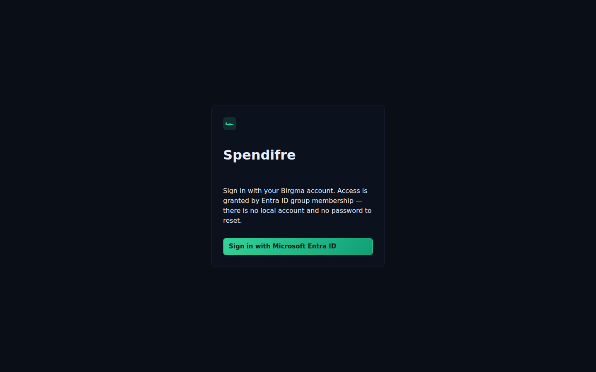

Spendifre has **no password of its own**. Select *Sign in with Microsoft Entra
ID* and you are authenticated with your normal Birgma account, including
whatever multi-factor step your account requires.

**Your role is decided by your Entra group membership**, not by anything you
choose here. There is no role picker. If you believe your access is wrong, that
is a directory-group change, not a setting inside Spendifre — talk to Group IT
Finance.

If you belong to more than one Spendifre group, you receive the **least**
privileged of them. That is deliberate: group membership sprawl should never
quietly escalate what someone can do.

---

## 2. Finding your way around

Every screen shares the same frame:

- **The left sidebar** groups sections under *Plan*, *Analyse*, *Approve* and
  *Govern*. **You only see the sections your role can use** — if you cannot find
  something described below, your role does not have it.
- **The header** shows where you are, the entity you are working on, and the
  actions available on that screen.
- **The footer of the sidebar** shows who you are signed in as, your role, and
  the region your data is served from, plus the theme toggle and *Sign out*.

Two conventions worth learning once:

**Money is monospaced** so columns line up, and always shows which currency it
is in.

**Increases are red, decreases are green** — the opposite of what you may
expect. This is a cost tool: growth is the unwanted direction. Every colour is
paired with a symbol (`▲ ▼ ✓ ◷ ✕`) so the meaning does not depend on seeing
colour.

---

## 3. Budget owner

You own one or more entities. You build their budgets, record what has been
spent, and submit for the CFO's approval.

### 3.1 The budget grid

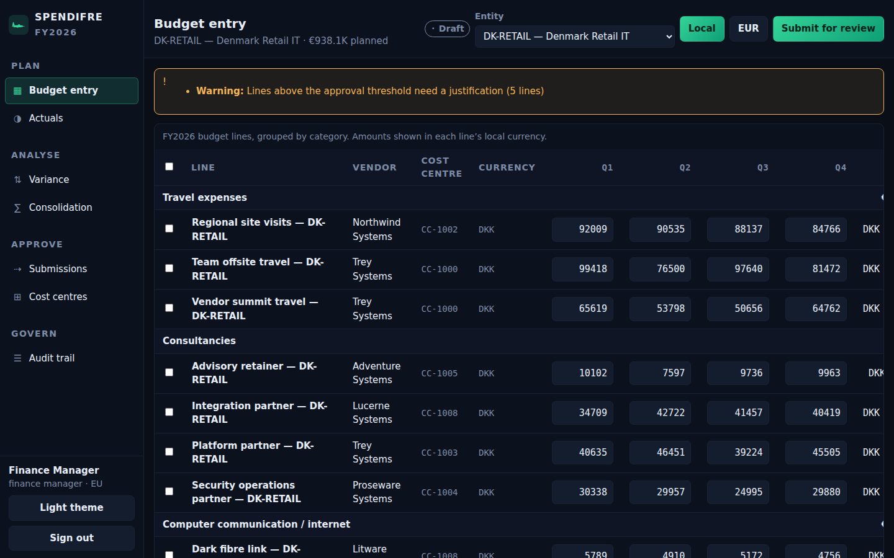

Your lines, grouped by category, with a column per quarter and a running total.

**To edit an amount**, click the cell, type, and click away or press Tab. It
saves as you leave the field. There is no *Save* button.

**The warning banner** above the grid lists anything that would fail validation.
Amber warnings do not stop you submitting; red blocking errors do.

**The Status column** tells you what needs attention:

| Chip | Meaning | What to do |
|---|---|---|
| ✓ Complete | The line has everything it needs | Nothing |
| ✕ Cost centre | Booked to a centre that is pending or rejected | Open the line and pick an approved centre |
| ◷ Over pace | Spending faster than the year is elapsing | Check the Actuals screen |
| ◷ Above threshold | Above the approval threshold | Add a justification — the CFO will ask otherwise |
| · Dormant | Headcount-linked while headcount planning is off | Nothing; it will wake up if planning is re-enabled |

**Category rows show the category total in EUR.** Those totals are always the
sum of the lines beneath them — if a line changes, the total changes. There is
no separately maintained figure to disagree.

### 3.2 Local and EUR

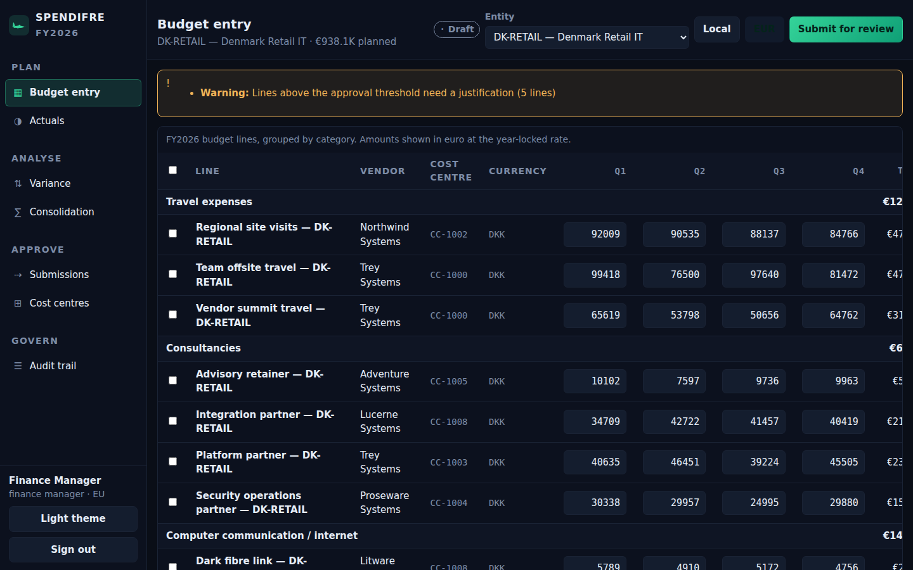

*Local* shows each line in its own currency. *EUR* shows everything converted at
the year-locked rate.

**A row never mixes currencies.** Whichever unit you pick applies to every money
column in that row, and the line's own currency code is always shown.

**You can type in either unit.** If you are in EUR mode and type a figure, it is
converted back to the line's local currency before it is stored — storage is
always local, so if Group IT Finance later restates an FX rate, every EUR figure
updates and nothing you typed is lost.

### 3.3 The line drawer

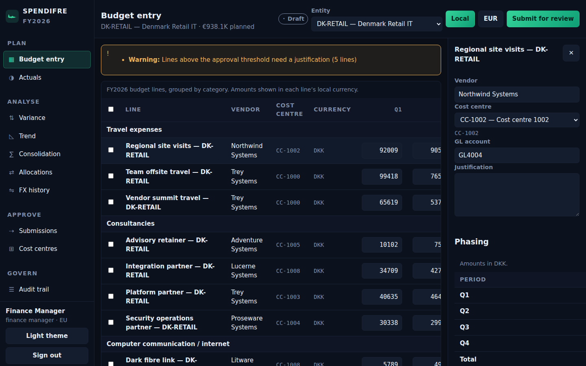

Click a line's name to open it. The drawer shows **every** field, including ones
hidden from the grid, plus phasing, justification and the comment thread.

- **Vendor, GL account, justification** — type and click away to save.
- **Cost centre** — a list of *approved* centres only. If the line is currently
  booked to a rejected or pending centre, you will still see that code displayed
  and flagged; it is not cleared behind your back, because losing the reference
  would lose the information that something needs fixing.
- **Phasing** — the plan and any recorded spend per period. If the line is
  driver-linked, these are computed and read-only.
- **Comments** — the discussion record. Anything you write here is stored
  exactly as typed and displayed as text; it is purged after 36 months.

Press `Escape` or the ✕ to close.

### 3.4 Working on many lines at once

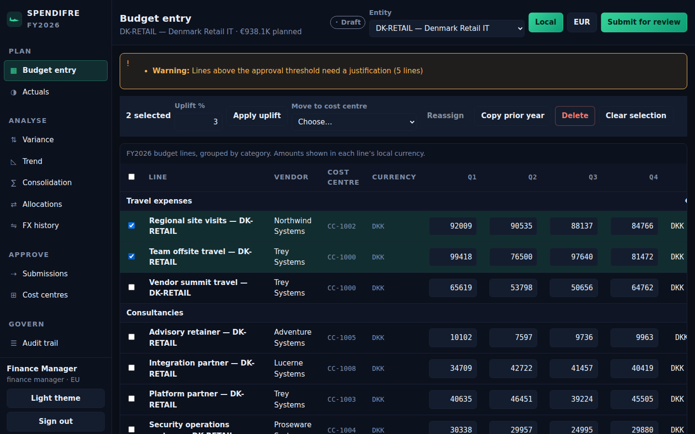

Tick the checkbox on any line and the bulk bar appears.

| Action | What it does |
|---|---|
| **Apply uplift** | Raises (or lowers, with a negative) every selected line by a percentage |
| **Reassign** | Moves the selection to a different approved cost centre |
| **Copy prior year** | Copies last year's quarterly figures onto the selected lines |
| **Delete** | Removes the selected lines |

Each bulk action is recorded once in the audit trail with the number of lines it
touched. If any selected line is outside what you may edit, the whole action is
refused rather than partly applied.

### 3.5 Recording actual spend

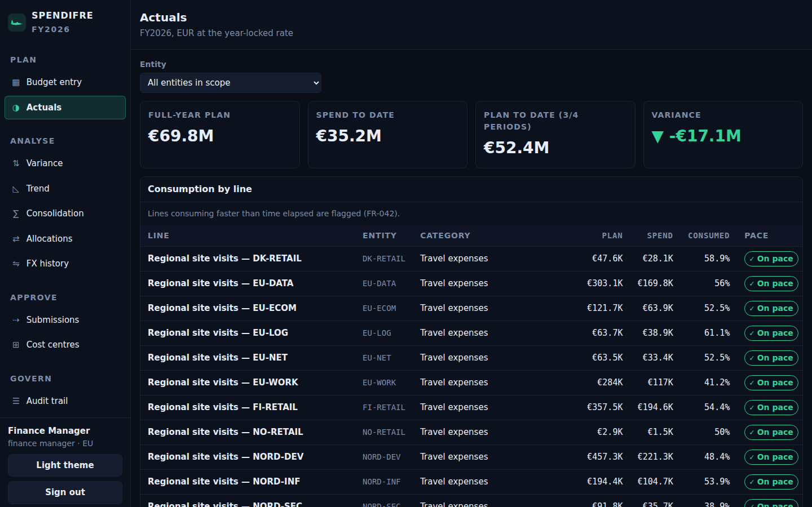

Enter what has actually been spent, per line, per period.

**You can only record spend against periods that have already elapsed.** That is
decided from the server's calendar, not your computer's — a future quarter is
refused.

The KPIs across the top compare full-year plan, spend to date, plan to date, and
the variance between the last two. Lines flagged **Over pace** are consuming
faster than the year is passing: two quarters in, a line that has spent more than
half its plan appears here.

If your entity's actuals are fed from the finance ledger, those periods are
read-only — hand-editing them would be silently overwritten by the next refresh.

### 3.6 Variance

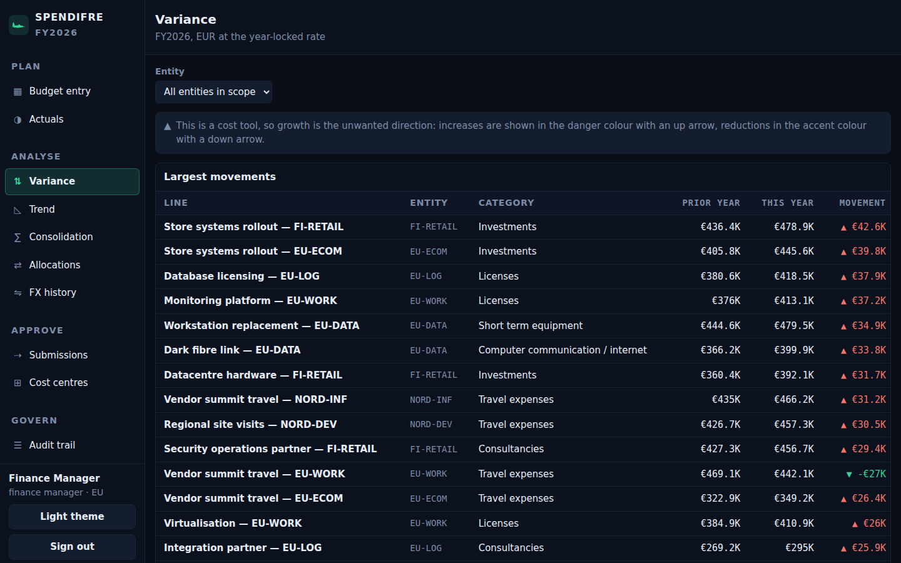

This year against last, biggest movements first. Remember the convention:
**red with ▲ means it went up**, which in a cost tool is the direction that
needs explaining.

### 3.7 Submitting

Use **Submit for review** in the header.

Before it goes, Spendifre re-checks the validation rules **on the server**:

- **Blocking** rules stop the submission and tell you which rule and how many
  lines. Fix them and try again.
- **Warnings** do not stop you, but the CFO will see the same flags.

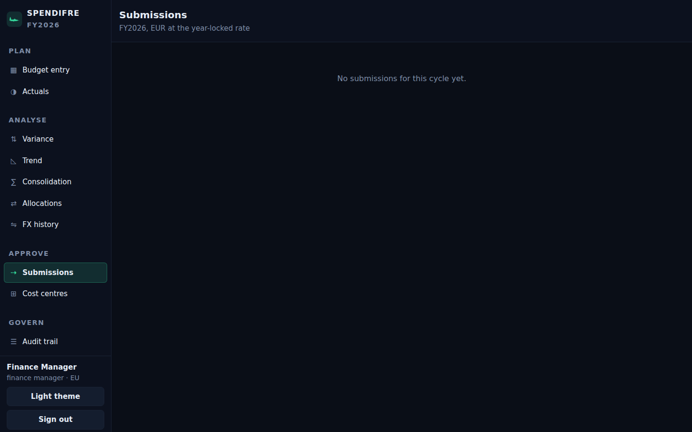

The Submissions screen shows what you have sent and where it stands. When the
CFO decides, their comment appears here.

| State | Meaning |
|---|---|
| Draft | Not yet submitted; editable |
| Submitted | With the CFO |
| Changes requested | Returned to you with a comment; edit and resubmit |
| Approved | Locked. Editing needs a CFO or Finance Manager exception |
| Locked | The cycle is closed |

**Once approved, your budget is immutable.** If something genuinely must change,
ask the CFO or a Finance Manager for a late-edit exception; it is time-limited
and recorded with the reason.

---

## 4. CFO

You review and decide every submission. **You cannot edit budget figures** —
that is deliberate, so that the person who decides is never the person who
prepared.

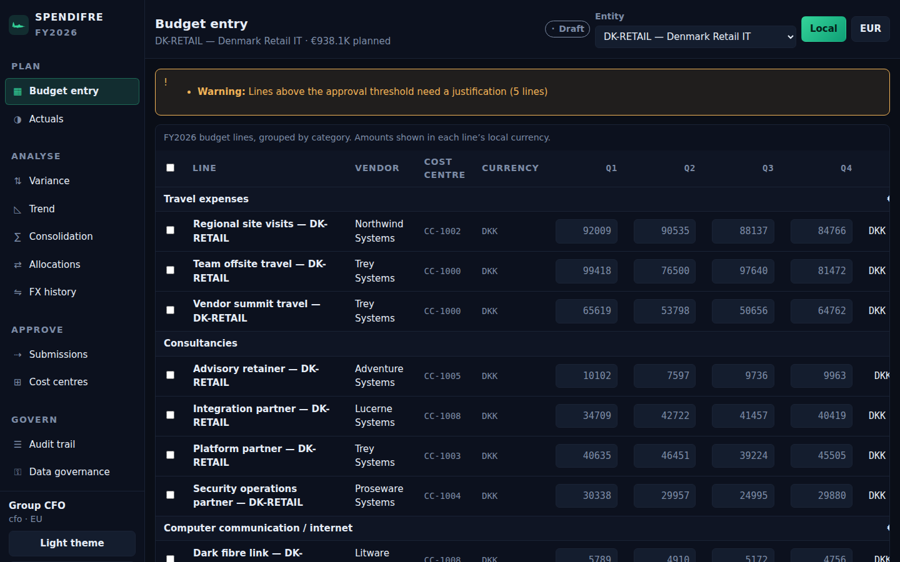

You can see every entity's budget in full; the editing controls are simply not
there for you.

### 4.1 Reviewing submissions

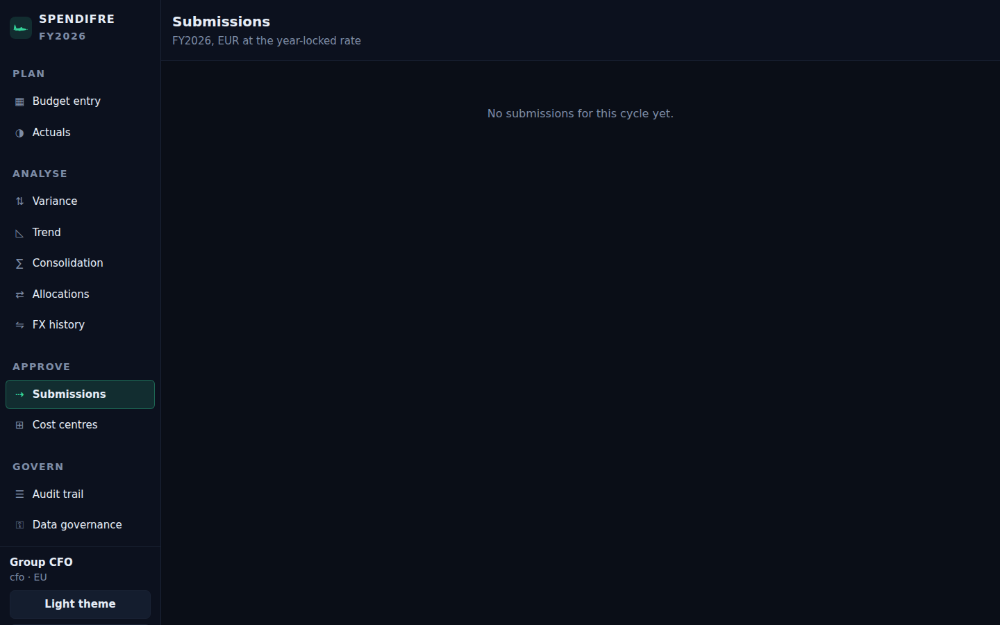

One card per submission, with who submitted it, when, and how many lines have
been approved or rejected so far.

**Write your comment first**, in the box above the cards — it is sent with your
decision and is what the owner reads.

| Decision | Effect |
|---|---|
| **Approve** | The budget is approved and becomes immutable |
| **Request more information** | Returns to the owner as *changes requested*, with your comment |
| **Reject** | Returns to draft |

You can also decide **individual lines** — approve, reject, or ask a question
against a specific line — or approve them all in one action.

**You cannot approve a submission you made yourself.** The database refuses it,
not just the screen.

### 4.2 Cost centres

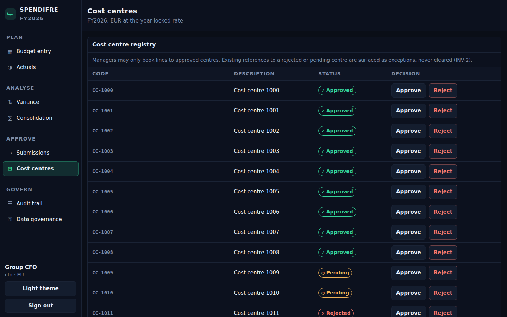

Group IT Finance creates cost centres; **you approve them**. Managers can only
book budget lines to approved centres.

You cannot approve a cost centre you created yourself — same rule as
submissions, enforced the same way.

Rejecting a centre does not silently clear it from lines already using it. Those
lines keep showing the code, flagged, so the owner can see what needs changing.

### 4.3 Consolidation

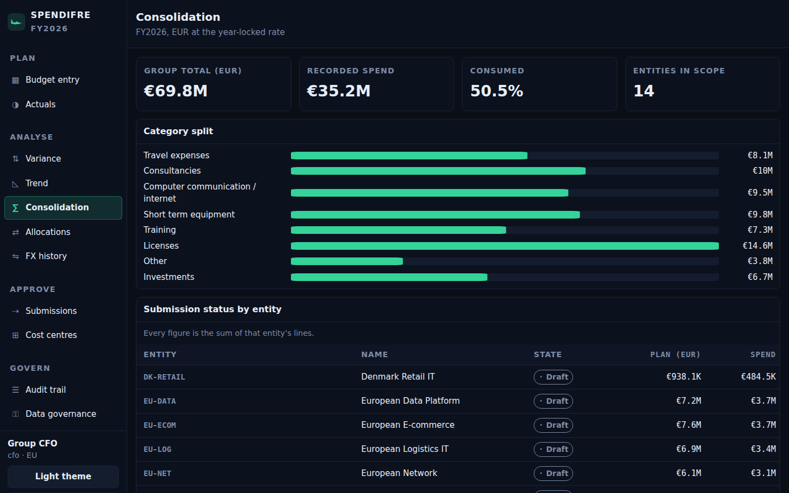

The group position: total, recorded spend, consumed percentage, category split
and submission status per entity.

Every figure is summed from line level. The category totals and the entity
totals both add back to the same group total — if they ever did not, that is a
bug, and there is a test that would have caught it.

You only see entities in **your deployment's region**. Swiss and APAC entities
are served by their own deployments; this is a data-residency requirement, not a
permission.

### 4.4 Trend

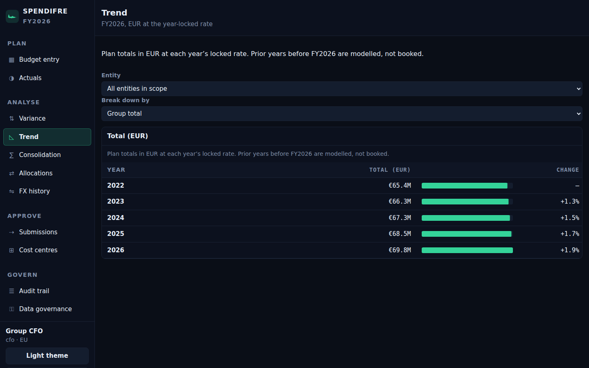

Five years of plan totals in EUR, with the year-on-year change beside each.
**Prior years are modelled from a growth factor, not booked actuals** — the
description on the screen says so, and you should read the earlier years as
shape rather than as history.

Two controls:

- **Entity** narrows to one entity, or leaves it at every entity you can see.
- **Break down by** switches between the group total, a split by category, and
  the largest individual lines.

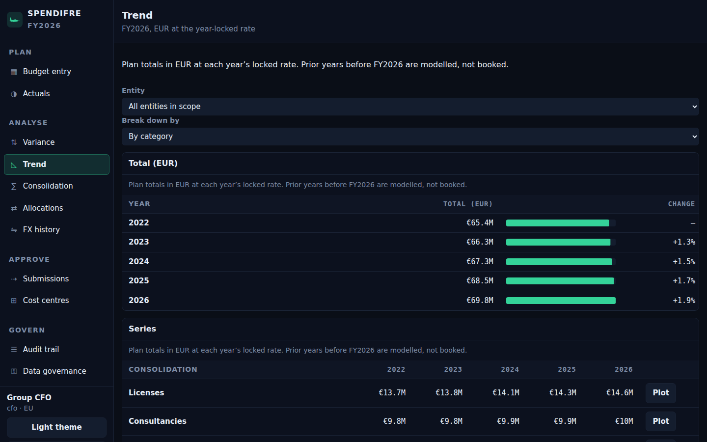

Choosing a breakdown adds a table of series below the chart. **Plot** on any row
charts that series in place of the total, so you can follow one category or one
line across five years. Choose it again to go back to the total.

### 4.5 Allocations

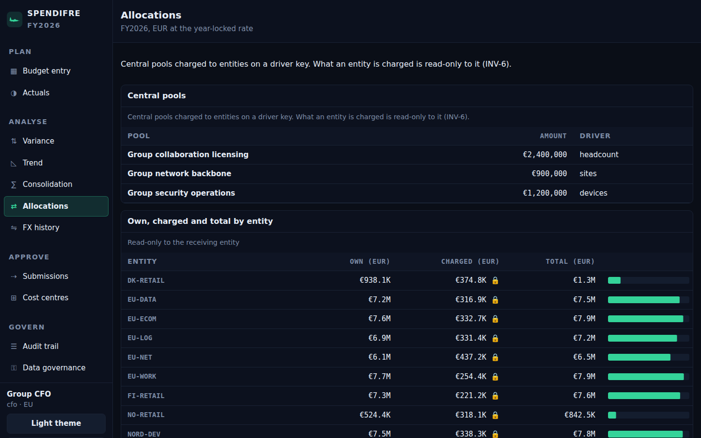

Central pools — group licensing, network, security operations — charged out to
entities on a driver: headcount, sites, devices or stores.

The lower table shows each entity's **own** plan, what it is **charged**, and the
**total** it therefore carries. The padlock beside a charged figure means the
receiving entity cannot change it. That is deliberate: an entity that could edit
its own allocation could opt out of a group cost.

### 4.6 FX history

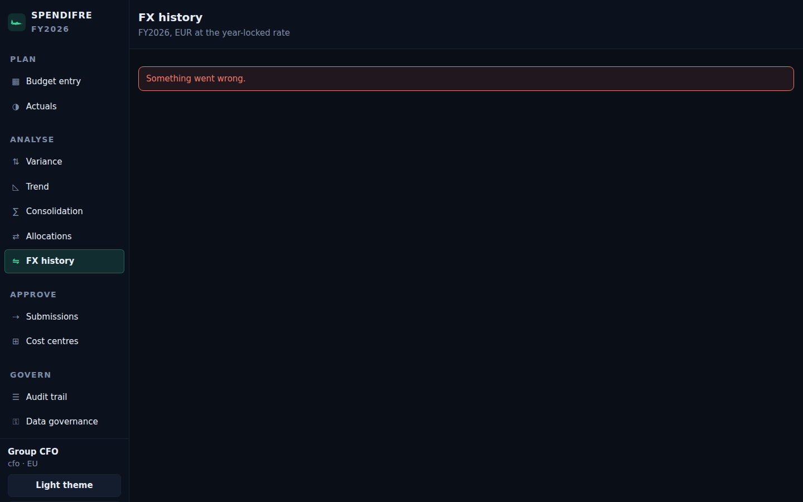

The rate to EUR for each currency across five years.

**Drift** is the difference between the first and the last rate on record.
**Volatility** is the spread between the highest and lowest rate as a share of
the mean — a plain range rather than a standard deviation, because five annual
points do not support a statistical claim, and you can check a range by eye
against the row it summarises.

This screen is read-only for everyone. Only an Administrator sets rates, and
only for the fiscal year.

### 4.7 Cycle control

You and the Finance Managers jointly own the cycle:

- **Phase** — collection → review → locked → reforecast.
- **Lock date** — closes submission on a date.
- **Late-edit exceptions** — reopen one entity for a set number of days, with a
  recorded reason.
- **Validation rules** — turn individual rules on or off, and choose whether
  each blocks or warns.

These are high-impact, so Spendifre asks you to sign in again if your session
has been open for a while.

---

## 5. Administrator

You are Group IT Finance. You set up the cycle and run the platform.

### 5.1 Template and reference data

- **Template fields** — rename, reorder, require or hide any field. Applies to
  every entity in the cycle.
- **Approval threshold** — the EUR figure above which lines are flagged.
- **Categories** — add, rename, reorder, mark capex or opex.
- **Cost centres** — you create them; the CFO approves them.
- **Entities** — create, remove, assign owners, set the residency region.
- **FX rates** — the year-locked rate per currency.
- **Allocation pools** — central costs charged out on a driver key.
- **Reminders** — a message to a target role, with a sent log.

**On FX rates:** changing a rate does **not** rewrite any stored figure. Amounts
are held in each line's own currency and converted when read, so one change
restates every derived figure consistently. Rates accept up to eight decimal
places, which matters for currencies like VND and LAK.

### 5.2 Template versions

A template version is a frozen set of line fields. You edit fields while a
version is a **draft**; publishing freezes it.

- **Only one draft at a time.** Two open drafts would make "the next version"
  ambiguous.
- **A published version cannot be edited.** If you need a change, open a new
  draft — it copies the current fields, so changing one label does not mean
  retyping the template.
- **Publishing does not disturb budgets already in progress.** An entity keeps
  the version it started on for the whole cycle. Entities that have not started
  adopt the new one.

When you publish, Spendifre tells you how many entities adopted the version and
how many kept theirs, and records both numbers in the audit trail. That second
number is the one to read: it is how many budgets are still being filled in
against the older field set.

### 5.3 Approval stages

The approval workflow is yours, not the approvers' — an approver who could
redraw their own gate would make the gate meaningless.

A stage has three things:

- **A name**, shown to whoever is waiting on it.
- **A role** that decides it. Only roles that can act as approvers may be named;
  Spendifre refuses any other, because a stage nobody can decide would wedge
  every submission above its threshold.
- **A threshold in EUR.** The stage applies only to budgets at or above it, so a
  small budget can legitimately skip a stage a large one must pass.

Stages run in order. A submission is approved only when every stage that applies
to it has approved. One rejection ends it, and a request for changes returns it
to the owner even if a later stage already approved — because the owner is about
to change the figures those approvals were given for.

Reordering takes the whole list at once. A partial reorder is refused rather
than silently leaving stages at stale positions.

### 5.4 Ledger ingestion

Once a finance system feeds actuals in, Spendifre stops relying on hand-entered
spend for the periods that feed covers.

- A batch carries the feed's **own reference**. Sending the same batch twice
  applies it once — safe for a nightly job to retry.
- A batch **applies completely or not at all**, so a dropped connection cannot
  leave half a month posted.
- Rows that cannot be matched are **kept as rejects**, not discarded. "The
  ledger sent forty rows we could not match" is something to act on.
- Once the ledger owns a period, **hand editing it is refused**.

Both the batch and its counts are recorded in the audit trail.

### 5.5 Consolidation

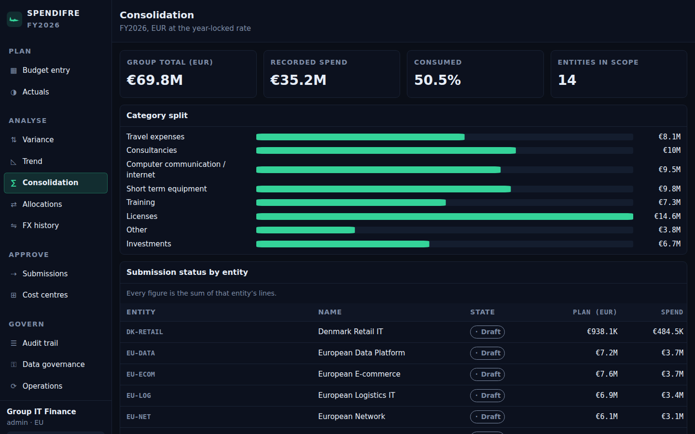

The same group view as the CFO, across every entity in your region.

### 5.6 Data governance

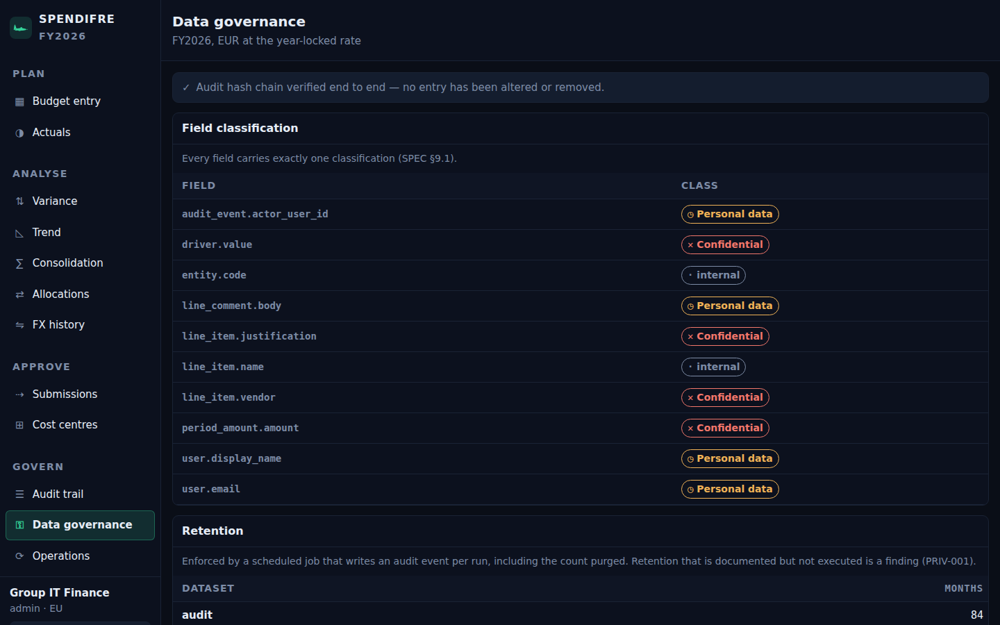

**Field classification** — every field carries exactly one of Public, Internal,
Confidential or Personal data.

**Retention** — how long each kind of data is kept. These are enforced by a
scheduled job that records what it purged, not by policy alone.

**Audit chain integrity** — the banner at the top confirms the audit trail
verifies end to end. Every audit entry is cryptographically linked to the one
before it, so if any entry were altered or removed — even directly in the
database — this check would name the exact point. **If it ever shows a break,
escalate immediately.**

**Data subject requests** — export everything held about one person, or
pseudonymise a departed employee. Pseudonymising replaces their name and email
and deletes their comments, but **keeps the audit entries**, which still prove
who approved what without identifying a person. Deleting them would break both
the audit chain and the statutory accounting record.

### 5.7 Operations

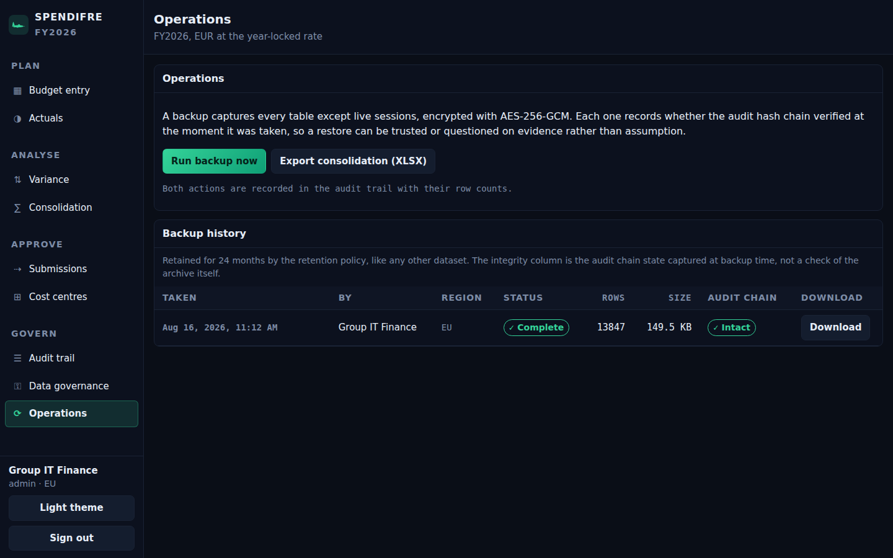

**Run backup** captures every table except live sessions, encrypted before it
touches storage.

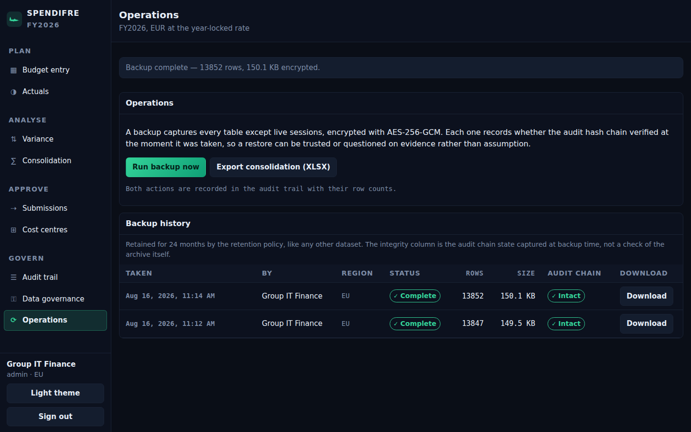

Each backup records:

| Column | Meaning |
|---|---|
| Rows | How many records it captured |
| Size | Encrypted size |
| **Audit chain** | Whether the audit trail verified **at the moment the backup was taken** |

That last column is the useful one. A backup that captured an intact chain is
evidence the record was sound at that point; one that captured a break tells you
*when* the break happened.

**Download** decrypts and streams the archive to you. The file on disk stays
encrypted, and its integrity is verified twice before a single byte is returned.

**Export consolidation (XLSX)** downloads the group position as a spreadsheet.
Text is made safe to open — a vendor name beginning with `=` cannot execute as a
formula in your Excel.

Both actions are recorded in the audit trail with their row counts, and both ask
you to re-authenticate if your session has been open a while. They move the
entire dataset in one action, so that is intentional friction.

> If *Run backup* is disabled, the deployment has no encryption key configured.
> Spendifre refuses to create a backup rather than writing one unencrypted.

---

## 6. Finance Manager — the extra powers

You are a budget owner like any other, **plus** two things nobody else has:

**Capex asset lives.** You are the only role that can approve or reject the
asset life on a capex line. Until you do, its depreciation schedule is
provisional. Not the CFO, not the Administrator — only you.

**Cycle co-ownership.** You share phase, lock date, exceptions and validation
rules with the CFO.

---

## 7. Everyone

### 7.1 The audit trail

Everyone can see the audit trail, but **what you see depends on your role**.

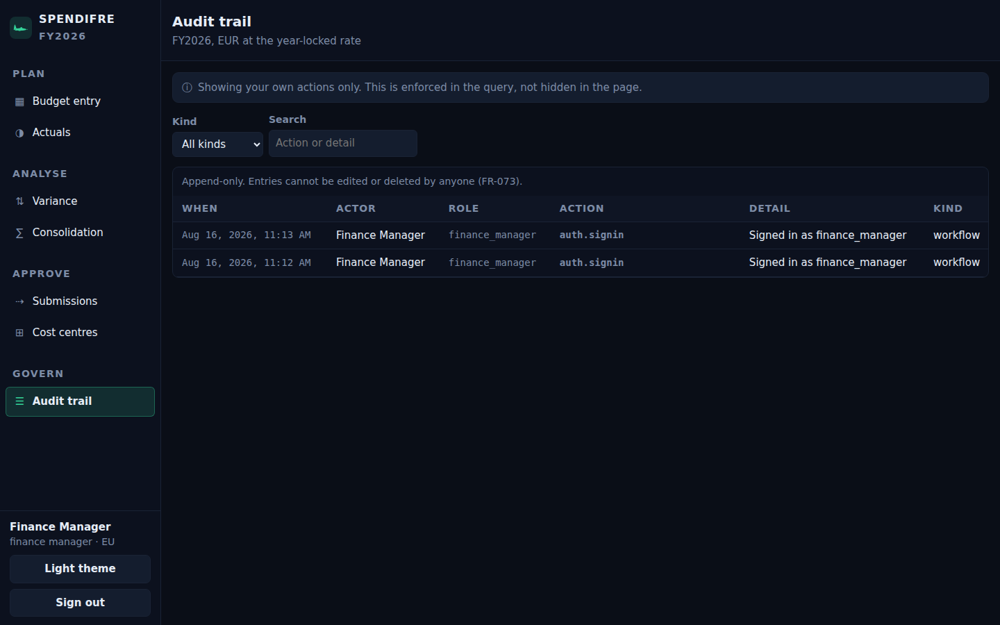

Managers see **only their own actions**. This is not a display filter — the
records are never fetched. The banner says so explicitly.

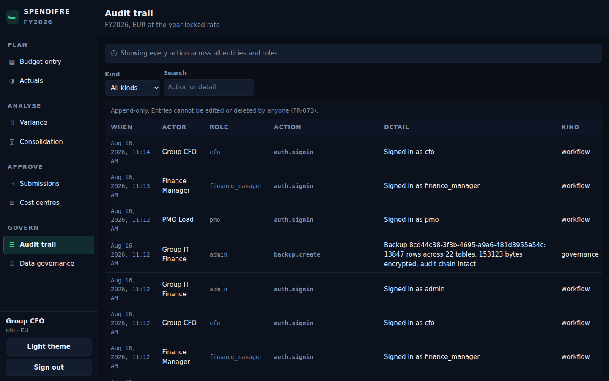

Administrators and the CFO see everything: every action, every actor, every
entity.

Filter by kind (change, approval, workflow, governance) or search the text.
**No one can edit or delete an audit entry** — not administrators, not the
database owner.

### 7.2 Themes

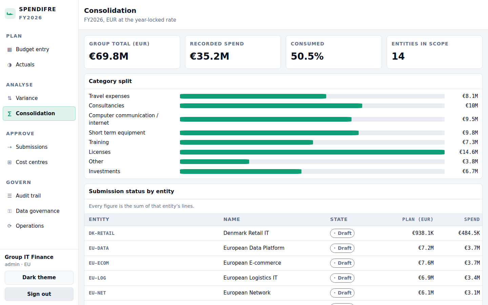

*Light theme* / *Dark theme* at the bottom of the sidebar. Both meet the same
contrast standard.

### 7.3 Accessibility

- Everything is reachable by keyboard; a *Skip to main content* link appears on
  the first Tab.
- The grid is a real table, so a screen reader announces the line, the period and
  the currency for each cell.
- Every status colour is paired with a symbol.
- Body text is never smaller than 14px.

### 7.4 If you only own one entity

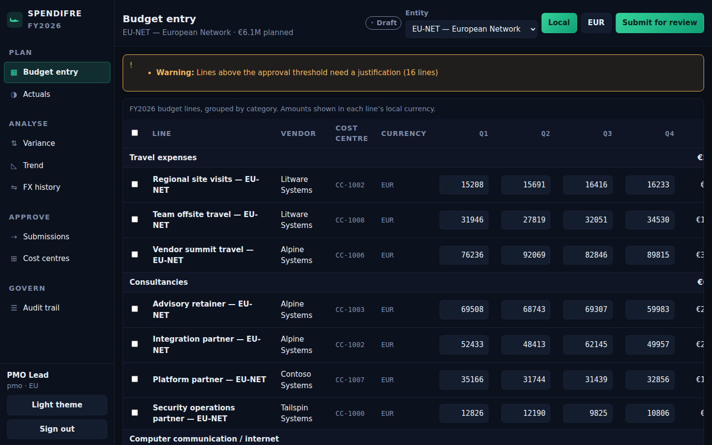

Roles scoped to one entity — Security, Architecture and PMO Managers — see no
entity picker and no filter rows, because there is nothing to choose between.
Consolidation is absent for the same reason.

---

## 8. What each role can and cannot do

The authoritative rules are in `SPEC.md` §5 and are enforced by the server.
Hiding a button is presentation; the refusal is real.

| Capability | Admin | CFO | Finance Mgr | CIO/CTO/Infra | Security/Arch/PMO |
|---|:--:|:--:|:--:|:--:|:--:|
| Edit own entity's lines | ✓ | — | ✓ | ✓ | ✓ |
| Edit another entity's lines | ✓ | — | — | — | — |
| View another entity's budget | ✓ | ✓ | read | read | — |
| Submit a budget | — | — | ✓ | ✓ | ✓ |
| Approve / reject a submission | — | ✓ | — | — | — |
| Decide individual lines | — | ✓ | — | — | — |
| Decide an approval stage | — | ✓ | ✓ | ✓ (CIO/CTO) | — |
| Configure the approval stages | ✓ | — | — | — | — |
| Approve a cost centre | — | ✓ | — | — | — |
| Create a cost centre | ✓ | — | — | — | — |
| Approve a capex asset life | — | — | ✓ | — | — |
| Move the cycle phase / lock date | — | ✓ | ✓ | — | — |
| Grant a late-edit exception | — | ✓ | ✓ | — | — |
| Define template fields | ✓ | — | — | — | — |
| Publish a template version | ✓ | — | — | — | — |
| Ingest a ledger batch | ✓ | — | — | — | — |
| Create / remove an entity | ✓ | — | — | — | — |
| Edit FX rates | ✓ | — | — | read | read |
| Record actual spend | ✓ | — | ✓ | ✓ | ✓ |
| Edit allocation pools | ✓ | — | — | — | — |
| View the full audit trail | ✓ | ✓ | — | — | — |
| View **your own** audit entries | ✓ | ✓ | ✓ | ✓ | ✓ |
| Change classification / retention | ✓ | ✓ | — | — | — |
| Run / download a backup | ✓ | — | — | — | — |

Two consequences worth stating plainly:

- **The CFO cannot edit any figure.** They approve, reject and ask questions.
- **Only the Finance Manager approves capex asset lives** — a deliberate split so
  no single person controls both the capital plan and its accounting treatment.
- **The Administrator configures approval stages but decides none of them**, and
  the roles that decide stages cannot configure them. An approver who could
  redraw their own gate would defeat the point of having stages.
- **Nobody can decide a stage on a budget they submitted.** That is enforced by a
  database trigger as well as by the handler, so it holds even if a future code
  path forgets.

---

## 9. When something is refused

| Message | Why | What to do |
|---|---|---|
| *You do not have permission to perform this action.* | Your role does not hold the capability | Check §8. If it looks wrong, it is a group-membership question |
| *Not found* on an entity you expected | Either it is outside your scope, or it belongs to another region | Deliberate: Spendifre does not confirm the existence of things you cannot see |
| *Re-authentication is required for this action.* | High-impact action, session open too long | Sign in again and retry |
| *The record changed since you loaded it.* | Someone else edited the same line | Reload and reapply your change — deliberately not silently overwritten |
| *Budget is approved and immutable* | The budget is approved or the cycle is locked | Ask the CFO or a Finance Manager for a late-edit exception |
| *Cost centre is not approved* | The centre is pending or rejected | Choose an approved centre, or ask the CFO to approve it |
| *Only elapsed periods accept recorded spend* | The period has not finished | Wait, or record against the current period |
| *Amount is driver-computed* | The line is driver-linked | Change the driver value or the rate, or unlink the driver |
| *Blocking validation rules* | A rule set to block is failing | The message names the rules; fix and resubmit |
| A stage refusal naming another role | An earlier stage is still waiting, or the stage is not yours to decide | The reason names the stage and the role. Open the submission's stages to see which is current |
| *This template version is published and immutable* | Fields are frozen once published | Open a new draft version; it copies the current fields |
| *No active line with that ledger reference* | A ledger row addressed a line that does not exist here, was deleted, or belongs to another region | Check the batch's rejects; the row is kept, not dropped |

---

*Spendifre is the Birgma / Biltema Group IT budget platform. Its governing
specification is `SPEC.md`. For architecture see [`docs/architecture/`](../architecture/);
for the security posture see [`docs/threat-model.md`](../threat-model.md).*
